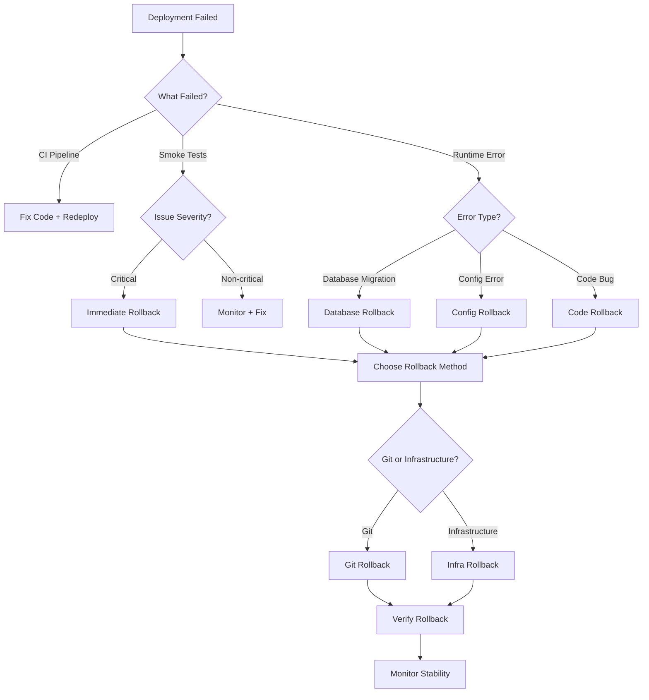

# Rollback Procedures

> How to rollback a failed deployment.

---

## Purpose

Restore application to previous stable state after deployment failure. Minimize downtime and user impact.

---

## Rollback Decision Tree



---

## Rollback Methods

### Method 1: Git Rollback (Code-level)

**When to use**: Code bug, build error, failed migration.

**Procedure**:

```bash
# Step 1: Identify failed commit
git log --oneline -n 10

# Step 2: Revert commit (safe)
git revert <failed-commit-hash>
git push origin main

# Step 3: Trigger redeployment
gh workflow run deploy.yml --ref main

# Step 4: Verify rollback
curl -I https://your-app.com
# Should show previous version

# Alternative: Reset to previous commit (dangerous)
git reset --hard <previous-good-commit>
git push --force origin main  # ⚠️ Use with caution
```

**Pros**:
- Safe (preserves history)
- Easy to undo
- Git tracks changes

**Cons**:
- Requires redeployment
- Slow (5-10 minutes)
- May fail if CI broken

---

### Method 2: Kubernetes Rollback (Infrastructure-level)

**When to use**: Container deployment, Kubernetes environment.

**Procedure**:

```bash
# Step 1: Check deployment history
kubectl rollout history deployment/your-app

# Output:
# REVISION  CHANGE-CAUSE
# 1         Initial deployment
# 2         Updated to v1.2.3
# 3         Updated to v1.2.4 (failed)

# Step 2: Rollback to previous revision
kubectl rollout undo deployment/your-app

# Or rollback to specific revision
kubectl rollout undo deployment/your-app --to-revision=2

# Step 3: Verify rollback status
kubectl rollout status deployment/your-app

# Step 4: Check pods
kubectl get pods -l app=your-app

# Step 5: Verify application
curl -I https://your-app.com
```

**Pros**:
- Fast (1-2 minutes)
- No code change needed
- Kubernetes handles rollout

**Cons**:
- Kubernetes-only
- Requires deployment history
- May fail if pod image unavailable

---

### Method 3: AWS Rollback (AWS-specific)

**When to use**: AWS Elastic Beanstalk, ECS, Lambda.

#### Elastic Beanstalk Rollback

```bash
# Step 1: List application versions
aws elasticbeanstalk describe-application-versions \
  --application-name your-app

# Step 2: Rollback to previous version
aws elasticbeanstalk update-environment \
  --environment-name your-app-env \
  --version-label v1.2.3

# Step 3: Verify environment health
aws elasticbeanstalk describe-environments \
  --environment-names your-app-env

# Step 4: Check application URL
curl -I http://your-app-env.elasticbeanstalk.com
```

---

#### ECS Rollback

```bash
# Step 1: Describe service
aws ecs describe-services \
  --cluster your-cluster \
  --services your-service

# Step 2: List task definitions
aws ecs list-task-definitions \
  --family-prefix your-app

# Step 3: Update to previous task definition
aws ecs update-service \
  --cluster your-cluster \
  --service your-service \
  --task-definition your-app:previous-version

# Step 4: Wait for service stability
aws ecs wait services-stable \
  --cluster your-cluster \
  --services your-service

# Step 5: Verify service
aws ecs describe-services \
  --cluster your-cluster \
  --services your-service
```

---

#### Lambda Rollback

```bash
# Step 1: List function versions
aws lambda list-versions-by-function \
  --function-name your-function

# Step 2: Get current version
aws lambda get-function-configuration \
  --function-name your-function

# Step 3: Update to previous version (or $LATEST)
aws lambda update-function-code \
  --function-name your-function \
  --s3-bucket your-bucket \
  --s3-key previous-version.zip

# Or update alias to previous version
aws lambda update-alias \
  --function-name your-function \
  --name production \
  --function-version previous-version

# Step 4: Verify function
aws lambda invoke \
  --function-name your-function \
  --payload '{"test": true}' \
  output.json
```

---

### Method 4: Heroku Rollback

**When to use**: Heroku deployment.

**Procedure**:

```bash
# Step 1: List releases
heroku releases --app your-app

# Output:
# v42  Deploy abc1234  me@example.com  2024/01/01 10:00
# v43  Deploy def5678  me@example.com  2024/01/01 11:00 (failed)

# Step 2: Rollback to previous release
heroku rollback v42 --app your-app

# Step 3: Verify rollback
heroku open --app your-app

# Step 4: Check logs
heroku logs --app your-app --tail
```

**Pros**:
- Fast (1-2 minutes)
- Heroku handles rollback
- Easy one-command rollback

**Cons**:
- Heroku-only
- Limited release history

---

### Method 5: Docker Rollback

**When to use**: Docker deployment, non-Kubernetes container environment.

**Procedure**:

```bash
# Step 1: List running containers
docker ps

# Step 2: Stop failed container
docker stop your-app-container
docker rm your-app-container

# Step 3: Run previous image version
docker run -d \
  --name your-app-container \
  -p 80:80 \
  -e DATABASE_URL=$DATABASE_URL \
  your-image:v1.2.3

# Step 4: Verify container
docker ps | grep your-app-container

# Step 5: Check logs
docker logs your-app-container

# Step 6: Verify application
curl -I http://localhost
```

**Pros**:
- Fast (< 1 minute)
- Simple Docker commands
- No orchestration needed

**Cons**:
- Manual process
- Docker-only
- No automatic rollback

---

## Rollback Scenarios

### Scenario 1: Smoke Test Failure

**Symptom**: Homepage returns HTTP 500 after deployment.

**Diagnosis**:
```bash
# Check logs
heroku logs --app your-app --tail

# Check error
curl -v https://your-app.com
# Returns HTTP 500 Internal Server Error
```

**Rollback**:
```bash
# Kubernetes
kubectl rollout undo deployment/your-app

# Heroku
heroku rollback v42 --app your-app

# Git
git revert abc1234
git push origin main
```

---

### Scenario 2: Database Migration Failure

**Symptom**: Migration error in CI pipeline.

**Diagnosis**:
```bash
# Check migration logs
kubectl logs deployment/your-app --tail=100 | grep migration

# Check database status
curl -s https://your-app.com/api/migrations/status
# Returns: {"pending_migrations": 1, "failed": true}
```

**Rollback**:
```bash
# Step 1: Revert migration commit
git revert migration-commit-hash

# Step 2: Manually rollback migration (if applied)
# Rails
rails db:migrate:down VERSION=20240101

# Django
python manage.py migrate app_name previous_migration

# Laravel
php artisan migrate:rollback --step=1

# Step 3: Push revert
git push origin main

# Step 4: Verify database
rails db:migrate:status
# Or equivalent for your framework
```

---

### Scenario 3: Configuration Error

**Symptom**: Environment variable missing, config file error.

**Diagnosis**:
```bash
# Check environment variables
kubectl exec deployment/your-app -- env | grep MISSING_VAR

# Check config file
kubectl exec deployment/your-app -- cat /app/config.yml
# Shows: missing: required_field
```

**Rollback**:
```bash
# Option 1: Fix config without rollback
kubectl set env deployment/your-app MISSING_VAR=value

# Option 2: Rollback to previous config
kubectl rollout undo deployment/your-app

# Option 3: Git rollback
git revert config-commit-hash
git push origin main
```

---

### Scenario 4: Dependency Failure

**Symptom**: npm install fails, pip install fails.

**Diagnosis**:
```bash
# Check CI logs
gh run view [run-id] --log | grep -i "npm install"

# Check error
npm ERR! Cannot resolve dependency "broken-package@1.0.0"
```

**Rollback**:
```bash
# Step 1: Revert dependency change
git revert dependency-commit-hash

# Step 2: Update package.json
npm install  # Verify it works

# Step 3: Push revert
git push origin main

# Step 4: Verify deployment
curl -I https://your-app.com
```

---

### Scenario 5: Third-Party Service Failure

**Symptom**: Payment gateway down, email service unreachable.

**Diagnosis**:
```bash
# Check third-party service status
curl -I https://api.stripe.com/v1/health
# Returns: HTTP 503 Service Unavailable

# Check application logs
kubectl logs deployment/your-app --tail=100 | grep stripe
```

**Rollback**:
```bash
# Option 1: Feature flag rollback (disable feature)
# Update config to disable payment feature
kubectl set env deployment/your-app ENABLE_PAYMENT=false

# Option 2: Code rollback (remove feature)
git revert feature-commit-hash
git push origin main

# Option 3: Infrastructure rollback
kubectl rollout undo deployment/your-app
```

---

## Rollback Verification

### Step-by-Step Verification

```bash
# 1. Check deployment status
kubectl get deployment your-app

# 2. Check pod status
kubectl get pods -l app=your-app

# 3. Check logs
kubectl logs deployment/your-app --tail=50

# 4. Check application URL
curl -I https://your-app.com

# 5. Run smoke tests
bash lib/deploy/smoke-tests-basic.sh

# 6. Check version
curl -s https://your-app.com/api/version | jq .version

# 7. Monitor for 10 minutes
# Watch logs, metrics, error rates
```

---

## Rollback Checklist

- [ ] Identify failed commit/deployment
- [ ] Choose rollback method (Git, Kubernetes, AWS, Heroku, Docker)
- [ ] Execute rollback command
- [ ] Verify rollback status
- [ ] Run smoke tests
- [ ] Monitor for stability (10+ minutes)
- [ ] Document rollback reason
- [ ] Create issue to fix root cause
- [ ] Notify team if production rollback

---

## Rollback Best Practices

### 1. Always Have a Rollback Plan

Before deployment, document:
- Previous good commit
- Previous deployment version
- Rollback command for your platform
- Expected rollback time

---

### 2. Test Rollback Before Production

```bash
# In staging environment
kubectl rollout undo deployment/your-app-staging
# Verify it works

# Then in production (if needed)
kubectl rollout undo deployment/your-app
```

---

### 3. Rollback Fast, Fix Later

**Priority**: Restore service first, fix root cause later.

**Time budget**: Rollback should complete in < 5 minutes.

---

### 4. Avoid Force Push

**Rule**: Use `git revert` instead of `git push --force`.

**Exception**: Force push only if revert fails and team agrees.

---

### 5. Monitor After Rollback

Rollback is not a fix. Monitor for:
- New errors
- Performance issues
- User complaints
- Third-party service status

---

### 6. Document Rollback

Create issue/ticket with:
- Why rollback was needed
- What failed (logs, errors)
- What was rolled back (commit, version)
- Next steps to fix

---

## Rollback Automation

### GitHub Actions Auto-Rollback

```yaml
name: Deploy with Auto-Rollback

on:
  push:
    branches: [main]

jobs:
  deploy:
    runs-on: ubuntu-latest
    steps:
      - name: Deploy
        run: kubectl apply -f deployment.yaml

      - name: Wait for deployment
        run: kubectl rollout status deployment/your-app --timeout=300s

      - name: Run smoke tests
        run: |
          curl -s https://your-app.com/api/health | jq -e '.status == "ok"'
        continue-on-error: true

      - name: Rollback if smoke tests fail
        if: failure()
        run: |
          kubectl rollout undo deployment/your-app
          kubectl rollout status deployment/your-app
```

---

### Kubernetes Auto-Rollback

```yaml
# deployment.yaml
apiVersion: apps/v1
kind: Deployment
metadata:
  name: your-app
spec:
  replicas: 3
  strategy:
    type: RollingUpdate
    rollingUpdate:
      maxUnavailable: 1
      maxSurge: 1
  template:
    spec:
      containers:
      - name: your-app
        image: your-image:latest
        readinessProbe:
          httpGet:
            path: /api/health
            port: 80
          initialDelaySeconds: 10
          periodSeconds: 5
          failureThreshold: 3
        livenessProbe:
          httpGet:
            path: /api/health
            port: 80
          initialDelaySeconds: 30
          periodSeconds: 10
          failureThreshold: 3
```

Kubernetes auto-rollback if readiness/liveness probe fails.

---

## Rollback Decision Matrix

| Failure Type | Rollback Method | Time | Automation |
|--------------|-----------------|------|------------|
| Smoke test fail | Kubernetes/AWS | 1-2m | Manual |
| CI pipeline fail | Git revert | 5-10m | Manual |
| Database migration | Git + manual | 10-20m | Manual |
| Config error | Config fix | 1-2m | Manual |
| Runtime error | Kubernetes | 1-2m | Auto (probe) |
| Third-party fail | Feature flag | 1-2m | Manual |

---

## Notes

- Rollback is **emergency recovery**, not a fix
- Always fix root cause after rollback
- Test rollback in staging before production
- Document rollback for team visibility
- Combine with monitoring for ongoing health checks
- Have rollback plan ready before deployment