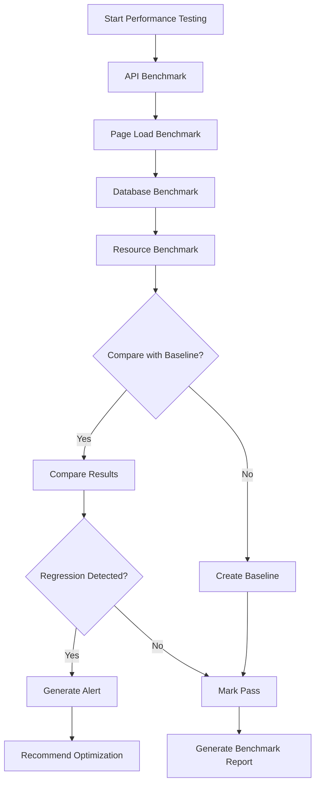

# /oa-benchmark — Performance Testing

> Automated performance testing and benchmarking.

## Purpose

Measure and benchmark application performance. Identify performance bottlenecks before production.

## When to Use

- After `/oa-qa-browser` (optional)
- After `/oa-land` (verify production performance)
- Manual performance testing: `/oa-benchmark`
- When user asks: "性能测试", "benchmark", "性能基准", "API 性能"

## Workflow



## Benchmark Types

### 1. API Response Time Benchmark

**Purpose**: Measure API endpoint response times.

**Method**: Send requests and measure latency.

**Implementation**:
```javascript
// API benchmark
import { test, expect } from '@playwright/test';

test('API benchmark: GET /api/users', async ({ request }) => {
  const iterations = 100;
  const responseTimes = [];
  
  for (let i = 0; i < iterations; i++) {
    const startTime = Date.now();
    await request.get('/api/users');
    const endTime = Date.now();
    responseTimes.push(endTime - startTime);
  }
  
  const avgTime = responseTimes.reduce((a, b) => a + b, 0) / iterations;
  const maxTime = Math.max(...responseTimes);
  const minTime = Math.min(...responseTimes);
  const p95 = responseTimes.sort()[Math.floor(iterations * 0.95)];
  
  expect(avgTime).toBeLessThan(200); // < 200ms average
  expect(p95).toBeLessThan(500); // < 500ms p95
});
```

---

### 2. Page Load Time Benchmark

**Purpose**: Measure page load performance.

**Method**: Measure DOMContentLoaded, Load, First Paint times.

**Implementation**:
```javascript
// Page load benchmark
import { test, expect } from '@playwright/test';

test('page load benchmark: homepage', async ({ page }) => {
  const metrics = await page.evaluate(() => {
    const timing = performance.timing;
    return {
      DNS: timing.domainLookupEnd - timing.domainLookupStart,
      TCP: timing.connectEnd - timing.connectStart,
      Request: timing.responseStart - timing.requestStart,
      Response: timing.responseEnd - timing.responseStart,
      DOMProcessing: timing.domComplete - timing.domLoading,
      TotalLoad: timing.loadEventEnd - timing.navigationStart,
    };
  });
  
  expect(metrics.DNS).toBeLessThan(100);
  expect(metrics.TCP).toBeLessThan(200);
  expect(metrics.Request).toBeLessThan(100);
  expect(metrics.Response).toBeLessThan(500);
  expect(metrics.DOMProcessing).toBeLessThan(1000);
  expect(metrics.TotalLoad).toBeLessThan(3000);
});
```

---

### 3. Database Query Benchmark

**Purpose**: Measure database query performance.

**Method**: Execute queries and measure execution time.

**Implementation**:
```javascript
// Database benchmark
import { test, expect } from '@playwright/test';

test('database benchmark: user queries', async ({ request }) => {
  const queries = [
    { name: 'SELECT users', endpoint: '/api/db-test/select-users' },
    { name: 'INSERT user', endpoint: '/api/db-test/insert-user' },
    { name: 'UPDATE user', endpoint: '/api/db-test/update-user' },
  ];
  
  for (const query of queries) {
    const iterations = 50;
    const times = [];
    
    for (let i = 0; i < iterations; i++) {
      const startTime = Date.now();
      await request.get(query.endpoint);
      const endTime = Date.now();
      times.push(endTime - startTime);
    }
    
    const avgTime = times.reduce((a, b) => a + b, 0) / iterations;
    
    console.log(`${query.name}: ${avgTime}ms average`);
    expect(avgTime).toBeLessThan(100);
  }
});
```

---

### 4. Resource Usage Benchmark

**Purpose**: Measure memory and CPU usage.

**Method**: Monitor resource consumption during operations.

**Implementation**:
```javascript
// Resource benchmark
import { test, expect } from '@playwright/test';

test('memory usage benchmark', async ({ page }) => {
  await page.goto('/');
  
  // Measure initial memory
  const initialMemory = await page.evaluate(() => {
    return (performance as any).memory.usedJSHeapSize;
  });
  
  // Perform operation
  await page.click('#load-data-button');
  await page.waitForSelector('.data-loaded');
  
  // Measure final memory
  const finalMemory = await page.evaluate(() => {
    return (performance as any).memory.usedJSHeapSize;
  });
  
  const memoryIncrease = finalMemory - initialMemory;
  
  expect(memoryIncrease).toBeLessThan(10 * 1024 * 1024); // < 10MB
});
```

---

## Benchmark Metrics

### Response Time Metrics

| Metric | Definition | Threshold |
|--------|------------|-----------|
| Average | Mean response time | < 200ms |
| Min | Minimum response time | N/A |
| Max | Maximum response time | < 1s |
| p50 (Median) | 50th percentile | < 150ms |
| p95 | 95th percentile | < 500ms |
| p99 | 99th percentile | < 1s |

---

### Page Load Metrics

| Metric | Definition | Threshold |
|--------|------------|-----------|
| DNS Lookup | DNS resolution time | < 100ms |
| TCP Connection | TCP handshake time | < 200ms |
| Request Time | Time to first byte | < 100ms |
| Response Time | Time to receive response | < 500ms |
| DOM Processing | DOM parsing time | < 1s |
| Total Load | Full page load time | < 3s |

---

### Core Web Vitals

| Metric | Definition | Threshold |
|--------|------------|-----------|
| FCP | First Contentful Paint | < 2s |
| LCP | Largest Contentful Paint | < 2.5s |
| CLS | Cumulative Layout Shift | < 0.1 |
| TBT | Total Blocking Time | < 300ms |
| FID | First Input Delay | < 100ms |

---

## Benchmark Templates

### Template 1: API Benchmark Suite

```javascript
// benchmarks/api.spec.js
import { test, expect } from '@playwright/test';

test.describe('API Benchmark Suite', () => {
  const endpoints = [
    { name: 'GET /api/users', method: 'GET', url: '/api/users' },
    { name: 'GET /api/products', method: 'GET', url: '/api/products' },
    { name: 'POST /api/orders', method: 'POST', url: '/api/orders', body: {} },
  ];
  
  for (const endpoint of endpoints) {
    test(`benchmark: ${endpoint.name}`, async ({ request }) => {
      const iterations = 100;
      const times = [];
      
      for (let i = 0; i < iterations; i++) {
        const startTime = Date.now();
        
        if (endpoint.method === 'GET') {
          await request.get(endpoint.url);
        } else if (endpoint.method === 'POST') {
          await request.post(endpoint.url, { data: endpoint.body });
        }
        
        const endTime = Date.now();
        times.push(endTime - startTime);
      }
      
      const metrics = calculateMetrics(times);
      
      console.log(`${endpoint.name}:`);
      console.log(`  Average: ${metrics.avg}ms`);
      console.log(`  Min: ${metrics.min}ms`);
      console.log(`  Max: ${metrics.max}ms`);
      console.log(`  p50: ${metrics.p50}ms`);
      console.log(`  p95: ${metrics.p95}ms`);
      console.log(`  p99: ${metrics.p99}ms`);
      
      expect(metrics.avg).toBeLessThan(200);
      expect(metrics.p95).toBeLessThan(500);
    });
  }
});

function calculateMetrics(times) {
  const sorted = times.sort((a, b) => a - b);
  const avg = times.reduce((a, b) => a + b, 0) / times.length;
  
  return {
    avg,
    min: sorted[0],
    max: sorted[sorted.length - 1],
    p50: sorted[Math.floor(times.length * 0.5)],
    p95: sorted[Math.floor(times.length * 0.95)],
    p99: sorted[Math.floor(times.length * 0.99)],
  };
}
```

---

### Template 2: Page Load Benchmark Suite

```javascript
// benchmarks/page-load.spec.js
import { test, expect } from '@playwright/test';

test.describe('Page Load Benchmark Suite', () => {
  const pages = [
    { name: 'Homepage', url: '/' },
    { name: 'Login', url: '/login' },
    { name: 'Dashboard', url: '/dashboard' },
    { name: 'Products', url: '/products' },
  ];
  
  for (const pageConfig of pages) {
    test(`benchmark: ${pageConfig.name}`, async ({ page }) => {
      const iterations = 10;
      const loadTimes = [];
      
      for (let i = 0; i < iterations; i++) {
        const startTime = Date.now();
        await page.goto(pageConfig.url, { waitUntil: 'networkidle' });
        const endTime = Date.now();
        loadTimes.push(endTime - startTime);
      }
      
      const avgLoadTime = loadTimes.reduce((a, b) => a + b, 0) / iterations;
      const maxLoadTime = Math.max(...loadTimes);
      
      console.log(`${pageConfig.name}:`);
      console.log(`  Average load time: ${avgLoadTime}ms`);
      console.log(`  Max load time: ${maxLoadTime}ms`);
      
      expect(avgLoadTime).toBeLessThan(3000);
      expect(maxLoadTime).toBeLessThan(5000);
    });
  }
});
```

---

### Template 3: Concurrent Request Benchmark

```javascript
// benchmarks/concurrent.spec.js
import { test, expect } from '@playwright/test';

test.describe('Concurrent Request Benchmark', () => {
  test('concurrent API requests', async ({ request }) => {
    const concurrentRequests = 50;
    const promises = [];
    
    for (let i = 0; i < concurrentRequests; i++) {
      promises.push(request.get('/api/users'));
    }
    
    const startTime = Date.now();
    const responses = await Promise.all(promises);
    const endTime = Date.now();
    
    const totalTime = endTime - startTime;
    const avgTime = totalTime / concurrentRequests;
    
    console.log(`Concurrent requests: ${concurrentRequests}`);
    console.log(`Total time: ${totalTime}ms`);
    console.log(`Average time per request: ${avgTime}ms`);
    
    // All requests should succeed
    for (const response of responses) {
      expect(response.status()).toBe(200);
    }
    
    // Total time should be reasonable
    expect(totalTime).toBeLessThan(10000); // < 10s for 50 requests
  });
  
  test('concurrent page loads', async ({ browser }) => {
    const concurrentPages = 10;
    const contexts = [];
    
    for (let i = 0; i < concurrentPages; i++) {
      contexts.push(browser.newContext());
    }
    
    const startTime = Date.now();
    const pages = await Promise.all(contexts.map(c => c.then(ctx => ctx.newPage())));
    
    await Promise.all(pages.map(page => page.goto('/', { waitUntil: 'networkidle' })));
    
    const endTime = Date.now();
    const totalTime = endTime - startTime;
    
    console.log(`Concurrent pages: ${concurrentPages}`);
    console.log(`Total time: ${totalTime}ms`);
    
    expect(totalTime).toBeLessThan(30000); // < 30s for 10 pages
    
    // Cleanup
    await Promise.all(pages.map(page => page.context().close()));
  });
});
```

---

## Baseline Comparison

### Create Baseline

```bash
# Run benchmark and save baseline
npx playwright test benchmarks/ --reporter=json --output=baseline.json
```

---

### Compare with Baseline

```javascript
// Compare current benchmark with baseline
import { test, expect } from '@playwright/test';
import baseline from './baseline.json';

test('compare with baseline', async ({ request }) => {
  const iterations = 100;
  const times = [];
  
  for (let i = 0; i < iterations; i++) {
    const startTime = Date.now();
    await request.get('/api/users');
    const endTime = Date.now();
    times.push(endTime - startTime);
  }
  
  const avgTime = times.reduce((a, b) => a + b, 0) / iterations;
  const baselineAvg = baseline.suites[0].specs[0].tests[0].results.avgTime;
  
  const regression = avgTime > baselineAvg * 1.2; // 20% slower
  
  if (regression) {
    console.log(`⚠️ Performance regression detected`);
    console.log(`  Baseline: ${baselineAvg}ms`);
    console.log(`  Current: ${avgTime}ms`);
    console.log(`  Regression: ${(avgTime / baselineAvg - 1) * 100}% slower`);
  }
  
  expect(regression).toBe(false);
});
```

---

## Integration Points

### After `/oa-qa-browser`

```
/oa-qa-browser → /oa-benchmark (optional)
```

User can enable auto-run after browser tests.

---

### After `/oa-land`

```
/oa-land → /oa-benchmark (verify production performance)
```

After deployment, run benchmarks on production URL.

---

### Manual Invocation

```
/oa-benchmark
```

Run performance benchmarks manually.

---

## Output Format

### Benchmark Report

```markdown
# Performance Benchmark Report

**Project**: [project name]
**URL**: https://your-app.com
**Date**: [timestamp]
**Baseline**: [baseline date] (optional)

---

## API Benchmarks

| Endpoint | Average | p50 | p95 | p99 | Max | Status |
|----------|---------|-----|-----|-----|-----|--------|
| GET /api/users | 120ms | 100ms | 250ms | 400ms | 500ms | ✓ Pass |
| GET /api/products | 150ms | 130ms | 300ms | 450ms | 600ms | ✓ Pass |
| POST /api/orders | 200ms | 180ms | 400ms | 600ms | 800ms | ✓ Pass |

---

## Page Load Benchmarks

| Page | Average Load Time | Max Load Time | Status |
|------|------------------|---------------|--------|
| Homepage | 1.5s | 2.0s | ✓ Pass |
| Login | 1.2s | 1.8s | ✓ Pass |
| Dashboard | 2.1s | 3.0s | ✓ Pass |
| Products | 2.5s | 3.5s | ✓ Pass |

---

## Core Web Vitals

| Metric | Value | Threshold | Status |
|--------|-------|-----------|--------|
| FCP | 1.2s | < 2s | ✓ Pass |
| LCP | 2.1s | < 2.5s | ✓ Pass |
| CLS | 0.05 | < 0.1 | ✓ Pass |
| TBT | 150ms | < 300ms | ✓ Pass |
| FID | 80ms | < 100ms | ✓ Pass |

---

## Concurrent Requests

| Concurrent Requests | Total Time | Avg per Request | Status |
|---------------------|------------|-----------------|--------|
| 50 requests | 8.5s | 170ms | ✓ Pass |
| 10 page loads | 25s | 2.5s | ✓ Pass |

---

## Baseline Comparison (if available)

| Metric | Baseline | Current | Change | Status |
|--------|----------|---------|--------|--------|
| GET /api/users avg | 110ms | 120ms | +9% | ✓ OK |
| Homepage load | 1.3s | 1.5s | +15% | ⚠️ Monitor |
| FCP | 1.0s | 1.2s | +20% | ⚠️ Monitor |

---

## Recommendations

1. Monitor homepage load time (15% slower than baseline)
2. Monitor FCP (20% slower than baseline)
3. All API endpoints within acceptable thresholds
4. No critical performance regressions detected

---

## Next Steps

1. Monitor metrics over next 24 hours
2. Optimize homepage if regression continues
3. Re-run benchmark in 1 week
```

---

### Regression Alert

```markdown
# Performance Regression Alert

**Project**: [project name]
**Date**: [timestamp]

---

## Critical Regression Detected

### API Endpoint: GET /api/users

**Baseline**: 110ms average
**Current**: 250ms average
**Regression**: 127% slower ⚠️

**Recommendation**:
- Check database query performance
- Review recent code changes to user endpoint
- Verify database indexes

---

### Page Load: Homepage

**Baseline**: 1.3s average
**Current**: 3.5s average
**Regression**: 169% slower ⚠️

**Recommendation**:
- Check for new large assets (images, JS bundles)
- Review lazy loading implementation
- Optimize critical rendering path

---

## Actions Required

1. Investigate API regression (critical)
2. Investigate homepage load regression (critical)
3. Fix identified issues
4. Re-run `/oa-benchmark` to verify fix
```

---

## Configuration

### Enable Auto-Run After Browser Tests

In `project.md`:
```markdown
## Performance Testing Settings

- Auto-run benchmarks: true
- Baseline comparison: enabled
- Regression threshold: 20%
- Alert on critical regression: true
```

---

### Thresholds Configuration

See `lib/performance/benchmark-templates.md` for benchmark templates and thresholds.

Custom thresholds can be added in `lib/performance/thresholds.md` (create if needed):
```markdown
## Performance Thresholds

### API Response Time
- Average: < 200ms
- p95: < 500ms
- p99: < 1s

### Page Load Time
- Average: < 3s
- Max: < 5s

### Core Web Vitals
- FCP: < 2s
- LCP: < 2.5s
- CLS: < 0.1
- TBT: < 300ms
- FID: < 100ms

### Concurrent Requests
- 50 concurrent API requests: < 10s total
- 10 concurrent page loads: < 30s total
```

---

## Examples

### Example 1: Full Benchmark Suite

```
User: /oa-benchmark

AI: Running performance benchmarks...

API Benchmarks:
✓ GET /api/users - 120ms avg (Pass)
✓ GET /api/products - 150ms avg (Pass)
✓ POST /api/orders - 200ms avg (Pass)

Page Load Benchmarks:
✓ Homepage - 1.5s avg (Pass)
✓ Login - 1.2s avg (Pass)
✓ Dashboard - 2.1s avg (Pass)

Core Web Vitals:
✓ FCP - 1.2s (Pass)
✓ LCP - 2.1s (Pass)
✓ CLS - 0.05 (Pass)
✓ TBT - 150ms (Pass)

Baseline Comparison:
⚠️ Homepage load: +15% slower (monitor)
⚠️ FCP: +20% slower (monitor)

All benchmarks passed. No critical regressions detected.
```

---

### Example 2: API Benchmark Only

```
User: Test API performance

AI: Running API benchmarks...

GET /api/users:
  Iterations: 100
  Average: 120ms ✓
  Min: 80ms
  Max: 500ms
  p50: 100ms
  p95: 250ms ✓
  p99: 400ms ✓

GET /api/products:
  Average: 150ms ✓
  p95: 300ms ✓

POST /api/orders:
  Average: 200ms ✓
  p95: 400ms ✓

All API endpoints within acceptable thresholds.
```

---

### Example 3: Regression Detection

```
User: /oa-benchmark

AI: Running performance benchmarks with baseline comparison...

⚠️ PERFORMANCE REGRESSION DETECTED

GET /api/users:
  Baseline: 110ms avg
  Current: 250ms avg
  Regression: +127% ⚠️ CRITICAL

Homepage load:
  Baseline: 1.3s avg
  Current: 3.5s avg
  Regression: +169% ⚠️ CRITICAL

Recommendations:
1. Check database query performance (users endpoint)
2. Check for new large assets (homepage)
3. Review recent code changes

Blocking further actions until regressions are fixed.
```

---

## Related Skills

- `/oa-qa-browser` — Browser testing (includes performance tests)
- `/oa-land` — Deployment verification (can trigger `/oa-benchmark`)
- `/oa-debugging` — Systematic debugging (for performance issues)
- `/oa-review` — Code review (includes performance awareness)

---

## Further Reading

- Core Web Vitals: https://web.dev/vitals/
- Web Performance API: https://developer.mozilla.org/en-US/docs/Web/API/Performance
- Playwright Performance: https://playwright.dev/docs/api-testing
- Performance Testing Best Practices: https://web.dev/performance/

---

## Notes

- Benchmarks are **optional** — user can choose to skip
- Baseline comparison requires **initial baseline run**
- Regression threshold is **configurable** (default 20%)
- Combine with monitoring (Datadog, CloudWatch) for ongoing performance tracking
- Run benchmarks on **staging first**, then **production**
- Performance regression alerts are **critical** — block further actions