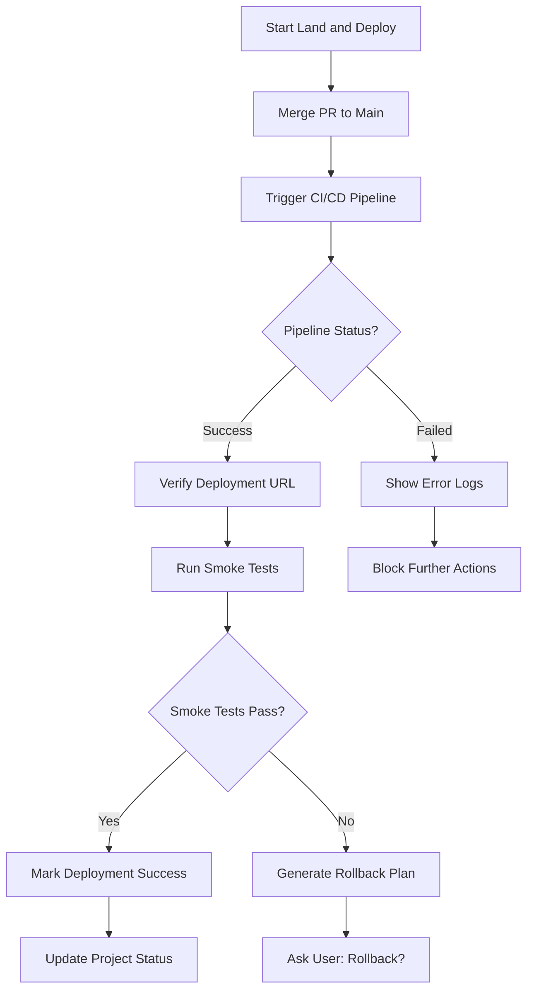

# /oa-land — Land and Deploy

> Verify deployment after merge. Catch deployment issues early.

## Purpose

Ensure deployment succeeds after merging code to main branch. Catch deployment failures before they reach production.

## When to Use

- After `/oa-ship` and successful PR merge
- After `/oa-merge` (optional auto-run)
- Manual deployment verification: `/oa-land`
- When user asks: "部署", "deploy", "land", "上线"

## Workflow



## Workflow Steps

### Step 1: Merge PR to Main

```bash
# GitHub
gh pr merge <pr-number> --merge --delete-branch

# GitLab
glab mr merge <mr-number>

# Bitbucket
# Manual merge via UI
```

**Pre-merge checks**:
- All CI checks passed
- No security issues (from `/oa-security`)
- Code review approved (from `/oa-review`)
- User confirmation

---

### Step 2: Trigger CI/CD Pipeline

Most CI systems auto-trigger on merge to main.

**Manual trigger (if needed)**:
```bash
# GitHub Actions
gh workflow run deploy.yml --ref main

# GitLab CI
glab pipeline run --branch main

# Jenkins
curl -X POST http://jenkins/job/deploy/build
```

---

### Step 3: Monitor Pipeline Status

```bash
# GitHub Actions
gh run watch --exit-status

# GitLab CI
glab pipeline status

# CircleCI
circleci watch

# Wait with timeout (default 10 minutes)
timeout 600 bash -c 'while ! gh run list --branch main --limit 1 --json conclusion | grep -q "success"; do sleep 10; done'
```

---

### Step 4: Verify Deployment URL

```bash
# Check deployment URL is accessible
curl -I https://your-app.com

# Check HTTP status
if curl -s -o /dev/null -w "%{http_code}" https://your-app.com | grep -q "200"; then
  echo "✓ Deployment URL accessible"
else
  echo "✗ Deployment URL not accessible"
fi

# Check DNS resolution
nslookup your-app.com

# Check SSL certificate
openssl s_client -connect your-app.com:443 -servername your-app.com
```

---

### Step 5: Run Smoke Tests

See `lib/deploy/smoke-tests.md` for detailed smoke test templates.

**Basic smoke tests**:
1. Homepage loads (HTTP 200)
2. API health endpoint responds
3. Authentication works (if applicable)
4. Database connection active
5. Static assets accessible

---

### Step 6: Generate Rollback Plan (if needed)

If deployment fails or smoke tests fail, generate rollback instructions.

See `lib/deploy/rollback.md` for rollback procedures.

---

## Integration Points

### After `/oa-ship`

```
/oa-ship → /oa-land (auto-run if enabled)
```

User can enable auto-run in project settings.

---

### After `/oa-merge`

```
/oa-merge → /oa-land
```

After successful merge, run `/oa-land` to verify deployment.

---

### Manual Invocation

```
/oa-land
```

Run deployment verification manually.

---

## Output Format

### Success Report

```markdown
# Land and Deploy Report

**Project**: [project name]
**PR**: #[pr number]
**Branch**: main
**Commit**: [commit hash]
**Date**: [timestamp]

---

## Deployment Status

✓ **SUCCESS**

---

## Pipeline Details

- **CI System**: GitHub Actions
- **Workflow**: deploy.yml
- **Run ID**: [run id]
- **Duration**: 5m 32s
- **Status**: Success

---

## Deployment URL

- **URL**: https://your-app.com
- **Status**: HTTP 200 OK
- **SSL**: Valid (expires 2025-12-31)
- **DNS**: Resolved to [IP address]

---

## Smoke Tests

| Test | Status | Response Time |
|------|--------|---------------|
| Homepage Load | ✓ Pass | 120ms |
| API Health Check | ✓ Pass | 50ms |
| Authentication | ✓ Pass | 200ms |
| Database Connection | ✓ Pass | 30ms |
| Static Assets | ✓ Pass | 40ms |

---

## Next Steps

1. Monitor application metrics
2. Check error logs for anomalies
3. Update project status: `deployed`
```

---

### Failure Report

```markdown
# Land and Deploy Report

**Project**: [project name]
**PR**: #[pr number]
**Branch**: main
**Commit**: [commit hash]
**Date**: [timestamp]

---

## Deployment Status

✗ **FAILED**

---

## Failure Details

- **Stage**: Smoke Tests
- **Error**: API health check failed (HTTP 500)
- **Log**: [error log excerpt]

---

## Rollback Plan

1. **Revert commit**:
   ```bash
   git revert [commit hash]
   git push origin main
   ```

2. **Manual rollback** (if revert fails):
   ```bash
   git reset --hard [previous commit]
   git push --force origin main
   ```

3. **Infrastructure rollback** (if needed):
   - Kubernetes: `kubectl rollout undo deployment/your-app`
   - AWS: Select previous version in deployment history
   - Heroku: `heroku rollback --app your-app`

4. **Verify rollback**:
   ```bash
   curl -I https://your-app.com
   # Should return HTTP 200 with previous version
   ```

---

## Next Steps

1. Review error logs
2. Fix deployment issue
3. Create new PR with fix
4. Rerun `/oa-land` after merge
```

---

## Smoke Tests

### Homepage Load Test

```bash
# HTTP status check
curl -s -o /dev/null -w "%{http_code}" https://your-app.com

# Response time check
curl -s -o /dev/null -w "%{time_total}" https://your-app.com

# Content check (optional)
curl -s https://your-app.com | grep -q "<title>Your App</title>"
```

---

### API Health Check

```bash
# Health endpoint
curl -s https://your-app.com/api/health

# Expected response
{
  "status": "ok",
  "version": "1.0.0",
  "timestamp": "2024-01-01T00:00:00Z"
}
```

---

### Authentication Test

```bash
# Login test
curl -s -X POST https://your-app.com/api/login \
  -H "Content-Type: application/json" \
  -d '{"username":"test","password":"test"}'

# Expected response
{
  "token": "eyJ...",
  "user": { "id": 1, "username": "test" }
}
```

---

### Database Connection Test

```bash
# Check database query
curl -s https://your-app.com/api/db-test

# Expected response
{
  "database": "connected",
  "query_time": "10ms"
}
```

---

### Static Assets Test

```bash
# CSS file
curl -s -o /dev/null -w "%{http_code}" https://your-app.com/static/styles.css

# JS file
curl -s -o /dev/null -w "%{http_code}" https://your-app.com/static/app.js

# Image file
curl -s -o /dev/null -w "%{http_code}" https://your-app.com/static/logo.png
```

---

## Rollback Procedures

### Git Rollback

```bash
# Soft rollback (revert commit)
git revert [commit-hash]
git push origin main

# Hard rollback (reset to previous commit)
git log --oneline -n 10  # Find previous good commit
git reset --hard [previous-commit]
git push --force origin main  # Dangerous, use with caution
```

---

### Kubernetes Rollback

```bash
# Check rollout history
kubectl rollout history deployment/your-app

# Rollback to previous version
kubectl rollout undo deployment/your-app

# Rollback to specific revision
kubectl rollout undo deployment/your-app --to-revision=2

# Verify rollback
kubectl rollout status deployment/your-app
```

---

### AWS Rollback

```bash
# Elastic Beanstalk
aws elasticbeanstalk describe-environments --environment-names your-app-env

# List deployment history
aws elasticbeanstalk describe-application-versions --application-name your-app

# Rollback to previous version
aws elasticbeanstalk update-environment \
  --environment-name your-app-env \
  --version-label previous-version

# ECS
aws ecs describe-services --cluster your-cluster --services your-service

# Update task definition to previous version
aws ecs update-service \
  --cluster your-cluster \
  --service your-service \
  --task-definition previous-task-definition
```

---

### Heroku Rollback

```bash
# List releases
heroku releases --app your-app

# Rollback to previous release
heroku rollback v42 --app your-app

# Verify rollback
heroku open --app your-app
```

---

### Docker Rollback

```bash
# List containers
docker ps

# Stop current container
docker stop your-app-container

# Run previous image version
docker run -d --name your-app-container \
  -p 80:80 \
  your-image:previous-version

# Verify rollback
curl -I http://localhost
```

---

## Configuration

### Enable Auto-Run After Ship

In `project.md`:
```markdown
## Deploy Settings

- Auto-run land after ship: true
- Smoke test timeout: 60 seconds
- Rollback on failure: prompt (ask user)
```

---

### Custom Smoke Tests

See `lib/deploy/smoke-tests.md` for detailed smoke test templates.

Custom tests can be added in `lib/deploy/custom-smoke-tests.md` (create if needed):
```markdown
## Custom Smoke Tests

### Test 1: Payment Flow
- URL: https://your-app.com/api/payment/test
- Expected: HTTP 200 with test transaction ID

### Test 2: Search Function
- URL: https://your-app.com/api/search?q=test
- Expected: HTTP 200 with search results

### Test 3: File Upload
- URL: https://your-app.com/api/upload
- Method: POST
- Expected: HTTP 200 with file ID
```

---

### Deployment Environments

In `project.md`:
```markdown
## Environments

### Production
- URL: https://your-app.com
- CI: GitHub Actions (deploy.yml)
- Smoke tests: full suite

### Staging
- URL: https://staging.your-app.com
- CI: GitHub Actions (deploy-staging.yml)
- Smoke tests: basic suite
```

---

## Examples

### Example 1: Successful Deployment

```
User: /oa-land

AI: Starting land and deploy workflow...

Step 1: Merging PR #42 to main...
✓ PR merged successfully

Step 2: Triggering CI/CD pipeline...
✓ GitHub Actions workflow deploy.yml started
✓ Run ID: 123456

Step 3: Monitoring pipeline status...
✓ Pipeline completed successfully (5m 32s)

Step 4: Verifying deployment URL...
✓ https://your-app.com accessible (HTTP 200)
✓ SSL certificate valid

Step 5: Running smoke tests...
✓ Homepage load: Pass (120ms)
✓ API health check: Pass (50ms)
✓ Authentication: Pass (200ms)
✓ Database connection: Pass (30ms)
✓ Static assets: Pass (40ms)

Deployment status: ✓ SUCCESS

Next steps: Monitor application metrics and error logs.
```

---

### Example 2: Deployment Failure

```
User: /oa-land

AI: Starting land and deploy workflow...

Step 1: Merging PR #43 to main...
✓ PR merged successfully

Step 2: Triggering CI/CD pipeline...
✓ GitHub Actions workflow deploy.yml started

Step 3: Monitoring pipeline status...
✗ Pipeline FAILED at stage "Deploy"
  → Error: Database migration failed
  → Log: migration.sql:42 - foreign key constraint violation

Step 4: Generating rollback plan...

Rollback options:
1. Git revert: git revert abc1234
2. Manual rollback: git reset --hard previous-commit
3. Infrastructure rollback: kubectl rollout undo deployment/your-app

Recommendation: Fix migration issue in new PR, then rerun /oa-land.

Would you like me to help with rollback? (yes/no)
```

---

### Example 3: Manual Deployment Check

```
User: Check deployment status

AI: Checking deployment status...

✓ CI pipeline: Success
✓ Deployment URL: https://your-app.com (HTTP 200)
✓ Smoke tests: All passing

Deployment is healthy. No issues detected.
```

---

### Example 4: Rollback After Failure

```
User: /oa-land failed, rollback please

AI: Initiating rollback...

Step 1: Reverting commit abc1234...
✓ Commit reverted successfully

Step 2: Pushing revert to main...
✓ Push successful

Step 3: Triggering CI/CD pipeline...
✓ Pipeline started (run ID: 123457)

Step 4: Monitoring rollback deployment...
✓ Rollback deployed successfully

Step 5: Verifying rollback...
✓ https://your-app.com accessible (HTTP 200)
✓ Version: previous-version (v1.2.3)

Rollback complete. Application restored to previous state.

Next step: Fix deployment issue and create new PR.
```

---

## Related Skills

- `/oa-ship` — Ship code (triggers `/oa-land` if auto-run enabled)
- `/oa-merge` — Merge PR (triggers `/oa-land`)
- `/oa-security` — Security audit (run before `/oa-land`)
- `/oa-review` — Code review (run before `/oa-land`)

---

## Further Reading

- CI/CD Best Practices: https://www.atlassian.com/continuous-delivery/principles/continuous-integration-vs-delivery-vs-deployment
- Kubernetes Rollbacks: https://kubernetes.io/docs/concepts/workloads/controllers/deployment/#rolling-back-a-deployment
- Heroku Rollbacks: https://devcenter.heroku.com/articles/releases-and-rollbacks
- AWS Deployment Best Practices: https://aws.amazon.com/blogs/devops/best-practices-for-ci-cd-with-aws-codepipeline/

---

## Notes

- `/oa-land` is **optional** — user can choose to deploy manually
- Smoke tests are **basic sanity checks** — not comprehensive testing
- Rollback is **user's responsibility** — AI provides guidance, not execution
- Combine with monitoring (Datadog, CloudWatch) for comprehensive coverage
- Test rollback procedures before production deployment