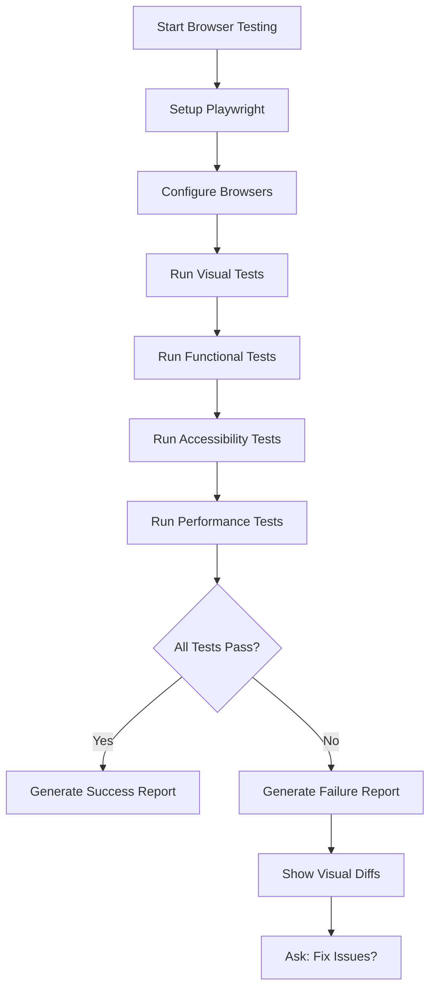

# /oa-qa-browser — Browser Testing

> Real browser testing with Playwright. Visual and functional validation.

## Purpose

Test application in real browsers with visual regression, functional tests, accessibility checks, and performance metrics. Catch issues that unit tests miss.

## When to Use

- After `/oa-execute` (optional)
- After `/oa-land` (verify deployed version)
- Manual browser testing: `/oa-qa-browser`
- When user asks: "测试这个功能", "browser test", "浏览器测试", "视觉回归测试"

## Workflow



## Test Types

### 1. Visual Regression Tests

**Purpose**: Detect unintended visual changes.

**Method**: Compare screenshots with baseline.

**Implementation**:
```javascript
// Playwright visual test
import { test, expect } from '@playwright/test';

test('homepage visual regression', async ({ page }) => {
  await page.goto('https://your-app.com');
  await expect(page).toHaveScreenshot('homepage.png', {
    maxDiffPixels: 100
  });
});
```

**Configuration**:
```javascript
// playwright.config.js
export default {
  use: {
    screenshot: 'on',
    video: 'retain-on-failure',
  },
};
```

---

### 2. Functional Tests

**Purpose**: Verify user flows work correctly.

**Method**: Simulate user interactions.

**Implementation**:
```javascript
// User login flow test
import { test, expect } from '@playwright/test';

test('user login flow', async ({ page }) => {
  // Navigate to login page
  await page.goto('https://your-app.com/login');
  
  // Fill login form
  await page.fill('#username', 'testuser');
  await page.fill('#password', 'testpass');
  
  // Submit form
  await page.click('#login-button');
  
  // Verify redirect to dashboard
  await expect(page).toHaveURL(/.*dashboard/);
  
  // Verify user element visible
  await expect(page.locator('.user-name')).toBeVisible();
});
```

---

### 3. Accessibility Tests

**Purpose**: Ensure WCAG 2.1 compliance.

**Method**: Run axe-core accessibility checks.

**Implementation**:
```javascript
// Accessibility test
import { test, expect } from '@playwright/test';
import AxeBuilder from '@axe-core/playwright';

test('homepage accessibility', async ({ page }) => {
  await page.goto('https://your-app.com');
  
  const accessibilityScanResults = await new AxeBuilder({ page })
    .withTags(['wcag2a', 'wcag2aa', 'wcag21aa'])
    .analyze();
  
  expect(accessibilityScanResults.violations).toEqual([]);
});
```

**WCAG Levels**:
- WCAG 2.1 Level A (minimum)
- WCAG 2.1 Level AA (recommended)
- WCAG 2.1 Level AAA (enhanced)

---

### 4. Performance Tests

**Purpose**: Measure Core Web Vitals.

**Method**: Use Playwright performance metrics.

**Implementation**:
```javascript
// Performance test
import { test, expect } from '@playwright/test';

test('homepage performance', async ({ page }) => {
  await page.goto('https://your-app.com');
  
  // Measure performance metrics
  const metrics = await page.evaluate(() => {
    return {
      // First Contentful Paint
      FCP: performance.getEntriesByName('first-contentful-paint')[0]?.startTime,
      
      // Largest Contentful Paint
      LCP: performance.getEntriesByName('largest-contentful-paint')[0]?.startTime,
      
      // Cumulative Layout Shift
      CLS: performance.getEntriesByType('layout-shift')
        .reduce((sum, entry) => sum + entry.value, 0),
      
      // Total Blocking Time
      TBT: performance.getEntriesByType('long-task')
        .reduce((sum, entry) => sum + (entry.duration - 50), 0),
    };
  });
  
  // Verify metrics meet thresholds
  expect(metrics.FCP).toBeLessThan(2000); // < 2s
  expect(metrics.LCP).toBeLessThan(2500); // < 2.5s
  expect(metrics.CLS).toBeLessThan(0.1);  // < 0.1
  expect(metrics.TBT).toBeLessThan(300);  // < 300ms
});
```

---

## Browser Coverage

### Desktop Browsers

```javascript
// playwright.config.js
export default {
  projects: [
    {
      name: 'chromium',
      use: { browserName: 'chromium' },
    },
    {
      name: 'firefox',
      use: { browserName: 'firefox' },
    },
    {
      name: 'webkit',
      use: { browserName: 'webkit' }, // Safari
    },
  ],
};
```

---

### Mobile Viewports

```javascript
// Mobile viewport test
import { test, expect } from '@playwright/test';

test.describe('Mobile tests', () => {
  test.use({ viewport: { width: 375, height: 667 } }); // iPhone SE
  
  test('mobile homepage', async ({ page }) => {
    await page.goto('https://your-app.com');
    await expect(page.locator('.mobile-nav')).toBeVisible();
  });
});
```

**Common viewports**:
- iPhone SE: 375x667
- iPhone 12: 390x844
- iPad: 768x1024
- iPad Pro: 1024x1366

---

## Test Templates

### Template 1: Homepage Test

```javascript
// tests/homepage.spec.js
import { test, expect } from '@playwright/test';
import AxeBuilder from '@axe-core/playwright';

test.describe('Homepage', () => {
  test.beforeEach(async ({ page }) => {
    await page.goto('https://your-app.com');
  });
  
  test('visual regression', async ({ page }) => {
    await expect(page).toHaveScreenshot('homepage.png');
  });
  
  test('functional: navigation works', async ({ page }) => {
    await page.click('#nav-about');
    await expect(page).toHaveURL(/.*about/);
  });
  
  test('accessibility: WCAG 2.1 AA', async ({ page }) => {
    const results = await new AxeBuilder({ page })
      .withTags(['wcag2aa', 'wcag21aa'])
      .analyze();
    expect(results.violations).toEqual([]);
  });
  
  test('performance: Core Web Vitals', async ({ page }) => {
    const metrics = await page.evaluate(() => ({
      FCP: performance.getEntriesByName('first-contentful-paint')[0]?.startTime,
      LCP: performance.getEntriesByName('largest-contentful-paint')[0]?.startTime,
    }));
    
    expect(metrics.FCP).toBeLessThan(2000);
    expect(metrics.LCP).toBeLessThan(2500);
  });
});
```

---

### Template 2: Login Flow Test

```javascript
// tests/login.spec.js
import { test, expect } from '@playwright/test';

test.describe('Login Flow', () => {
  test('successful login', async ({ page }) => {
    await page.goto('https://your-app.com/login');
    
    await page.fill('#username', 'testuser');
    await page.fill('#password', 'testpass');
    await page.click('#login-button');
    
    await expect(page).toHaveURL(/.*dashboard/);
    await expect(page.locator('.user-name')).toContainText('testuser');
  });
  
  test('failed login: wrong password', async ({ page }) => {
    await page.goto('https://your-app.com/login');
    
    await page.fill('#username', 'testuser');
    await page.fill('#password', 'wrongpass');
    await page.click('#login-button');
    
    await expect(page.locator('.error-message')).toBeVisible();
    await expect(page).toHaveURL(/.*login/);
  });
  
  test('validation: empty fields', async ({ page }) => {
    await page.goto('https://your-app.com/login');
    
    await page.click('#login-button');
    
    await expect(page.locator('#username-error')).toBeVisible();
    await expect(page.locator('#password-error')).toBeVisible();
  });
});
```

---

### Template 3: Mobile Responsive Test

```javascript
// tests/responsive.spec.js
import { test, expect } from '@playwright/test';

test.describe('Responsive Design', () => {
  test('desktop layout', async ({ page }) => {
    await page.setViewportSize({ width: 1280, height: 720 });
    await page.goto('https://your-app.com');
    
    await expect(page.locator('.desktop-nav')).toBeVisible();
    await expect(page.locator('.mobile-nav')).not.toBeVisible();
  });
  
  test('mobile layout', async ({ page }) => {
    await page.setViewportSize({ width: 375, height: 667 });
    await page.goto('https://your-app.com');
    
    await expect(page.locator('.mobile-nav')).toBeVisible();
    await expect(page.locator('.desktop-nav')).not.toBeVisible();
  });
  
  test('tablet layout', async ({ page }) => {
    await page.setViewportSize({ width: 768, height: 1024 });
    await page.goto('https://your-app.com');
    
    await expect(page.locator('.tablet-nav')).toBeVisible();
  });
});
```

---

## Setup

### Install Playwright

```bash
# Initialize Playwright
npm init playwright@latest

# Or manual install
npm install -D @playwright/test
npx playwright install
```

---

### Configuration

```javascript
// playwright.config.js
import { defineConfig, devices } from '@playwright/test';

export default defineConfig({
  testDir: './tests',
  fullyParallel: true,
  forbidOnly: !!process.env.CI,
  retries: process.env.CI ? 2 : 0,
  workers: process.env.CI ? 1 : undefined,
  reporter: 'html',
  use: {
    baseURL: 'https://your-app.com',
    trace: 'on-first-retry',
    screenshot: 'on',
    video: 'retain-on-failure',
  },
  
  projects: [
    {
      name: 'chromium',
      use: { ...devices['Desktop Chrome'] },
    },
    {
      name: 'firefox',
      use: { ...devices['Desktop Firefox'] },
    },
    {
      name: 'webkit',
      use: { ...devices['Desktop Safari'] },
    },
    {
      name: 'Mobile Chrome',
      use: { ...devices['Pixel 5'] },
    },
    {
      name: 'Mobile Safari',
      use: { ...devices['iPhone 12'] },
    },
  ],
  
  webServer: {
    command: 'npm run start',
    url: 'http://localhost:3000',
    reuseExistingServer: !process.env.CI,
  },
});
```

---

## Running Tests

### Run All Tests

```bash
# Run all browser tests
npx playwright test

# Run specific test file
npx playwright test tests/homepage.spec.js

# Run specific browser
npx playwright test --project=chromium

# Run in UI mode (interactive)
npx playwright test --ui
```

---

### Run Visual Tests

```bash
# Update screenshots (baseline)
npx playwright test --update-snapshots

# Compare with baseline
npx playwright test

# View report
npx playwright show-report
```

---

### Run Accessibility Tests

```bash
# Install axe-core
npm install -D @axe-core/playwright

# Run accessibility tests
npx playwright test tests/accessibility.spec.js

# Generate axe report
npx playwright test --reporter=html
```

---

## Integration Points

### After `/oa-execute`

```
/oa-execute → /oa-qa-browser (optional)
```

User can enable auto-run in project settings.

---

### After `/oa-land`

```
/oa-land → /oa-qa-browser (verify deployed version)
```

After deployment, run browser tests on production URL.

---

### Manual Invocation

```
/oa-qa-browser
```

Run browser tests manually.

---

## Output Format

### Success Report

```markdown
# Browser Testing Report

**Project**: [project name]
**URL**: https://your-app.com
**Date**: [timestamp]

---

## Test Summary

✓ **ALL TESTS PASSED**

| Test Type | Passed | Failed | Total |
|-----------|--------|--------|-------|
| Visual Regression | 10 | 0 | 10 |
| Functional | 15 | 0 | 15 |
| Accessibility | 5 | 0 | 5 |
| Performance | 4 | 0 | 4 |

---

## Browser Coverage

| Browser | Status |
|---------|--------|
| Chromium (Desktop) | ✓ Pass |
| Firefox (Desktop) | ✓ Pass |
| WebKit (Safari) | ✓ Pass |
| Mobile Chrome | ✓ Pass |
| Mobile Safari | ✓ Pass |

---

## Performance Metrics

| Metric | Value | Threshold | Status |
|--------|-------|-----------|--------|
| FCP | 1.2s | < 2s | ✓ Pass |
| LCP | 2.1s | < 2.5s | ✓ Pass |
| CLS | 0.05 | < 0.1 | ✓ Pass |
| TBT | 150ms | < 300ms | ✓ Pass |

---

## Accessibility Score

- **WCAG 2.1 A**: 0 violations ✓
- **WCAG 2.1 AA**: 0 violations ✓
- **WCAG 2.1 AAA**: 0 violations ✓

---

## Next Steps

1. No issues found
2. Proceed to production deployment
```

---

### Failure Report

```markdown
# Browser Testing Report

**Project**: [project name]
**URL**: https://your-app.com
**Date**: [timestamp]

---

## Test Summary

✗ **TESTS FAILED**

| Test Type | Passed | Failed | Total |
|-----------|--------|--------|-------|
| Visual Regression | 8 | 2 | 10 |
| Functional | 14 | 1 | 15 |
| Accessibility | 4 | 1 | 5 |
| Performance | 3 | 1 | 4 |

---

## Failed Tests

### Visual Regression Failure

#### Test: homepage.png

**Baseline**: tests/screenshots/homepage.png
**Actual**: test-results/homepage-actual.png
**Diff**: test-results/homepage-diff.png

**Details**: Logo position shifted 5px to the right

**Recommendation**: Check CSS changes for `.logo` class

---

### Functional Failure

#### Test: user login flow

**Error**: Timeout waiting for element '.user-name'

**Location**: tests/login.spec.js:23

**Details**: Login redirect failed, user stayed on login page

**Recommendation**: Check authentication backend response

---

### Accessibility Failure

#### Test: homepage accessibility

**Violation**: Color contrast ratio too low

**Rule**: WCAG 2.1 AA - color-contrast

**Element**: `.cta-button`

**Expected**: Contrast ratio >= 4.5:1

**Actual**: Contrast ratio 3.2:1

**Recommendation**: Change button background color to darker shade

---

### Performance Failure

#### Test: homepage performance

**Metric**: Largest Contentful Paint (LCP)

**Value**: 3.5s

**Threshold**: < 2.5s

**Recommendation**: Optimize hero image loading, use preload or lazy loading

---

## Next Steps

1. Fix visual regression (logo position)
2. Debug login flow (authentication)
3. Improve color contrast (accessibility)
4. Optimize LCP (performance)
5. Rerun `/oa-qa-browser`
```

---

## Configuration

### Enable Auto-Run After Execute

In `project.md`:
```markdown
## Browser Testing Settings

- Auto-run browser tests: true
- Visual regression threshold: 100 pixels
- Accessibility level: WCAG 2.1 AA
- Performance thresholds:
  - FCP: 2s
  - LCP: 2.5s
  - CLS: 0.1
  - TBT: 300ms
```

---

### Custom Test Configuration

In `lib/browser/playwright-config.md`:
```markdown
## Custom Playwright Configuration

### Test Directory
- tests/e2e/ — End-to-end tests
- tests/visual/ — Visual regression tests
- tests/accessibility/ — Accessibility tests
- tests/performance/ — Performance tests

### Custom Viewports
- Desktop HD: 1920x1080
- Desktop SD: 1280x720
- Tablet: 1024x768
- Mobile Large: 414x896
- Mobile Small: 375x667
```

---

## Examples

### Example 1: Full Browser Test

```
User: /oa-qa-browser

AI: Running browser tests...

Setup: Installing Playwright dependencies...
✓ Playwright installed
✓ Chromium browser installed
✓ Firefox browser installed
✓ WebKit browser installed

Running tests:

Visual Regression Tests:
✓ homepage.png - Pass
✓ about.png - Pass
✗ dashboard.png - Fail (5px shift in sidebar)

Functional Tests:
✓ login flow - Pass
✗ search flow - Fail (timeout waiting for results)

Accessibility Tests:
✓ WCAG 2.1 A - Pass
✗ WCAG 2.1 AA - Fail (color contrast violation)

Performance Tests:
✓ FCP - Pass (1.2s)
✗ LCP - Fail (3.5s > 2.5s threshold)

Browser Coverage:
✓ Chromium - 4/5 tests pass
✓ Firefox - 4/5 tests pass
✗ WebKit - 3/5 tests pass

Test results: 8 passed, 4 failed

Failed tests require fixing before proceeding.
```

---

### Example 2: Visual Regression Only

```
User: Run visual regression tests

AI: Running visual regression tests...

Baseline comparison:
✓ homepage.png - No changes detected
✓ about.png - No changes detected
✗ dashboard.png - Changes detected

Visual diff for dashboard.png:
- Baseline: tests/screenshots/dashboard.png
- Actual: test-results/dashboard-actual.png
- Diff: test-results/dashboard-diff.png (5px shift in sidebar)

Recommendation: Review recent CSS changes to sidebar layout.
```

---

### Example 3: Accessibility Audit

```
User: Check accessibility compliance

AI: Running accessibility audit...

WCAG 2.1 Level A:
✓ All checks pass

WCAG 2.1 Level AA:
✗ 1 violation found

Violation: color-contrast
- Element: .cta-button
- Foreground: #FFFFFF
- Background: #FF6B6B
- Contrast ratio: 3.2:1 (expected >= 4.5:1)

Recommendation: Change background to darker color (#E63946)
```

---

## Related Skills

- `/oa-verify` — Unit/integration tests (non-browser)
- `/oa-benchmark` — Performance testing (API/backend)
- `/oa-review` — Code review (includes accessibility awareness)
- `/oa-land` — Deployment verification (can trigger `/oa-qa-browser`)

---

## Further Reading

- Playwright Docs: https://playwright.dev/
- axe-core: https://github.com/dequelabs/axe-core
- Core Web Vitals: https://web.dev/vitals/
- WCAG 2.1: https://www.w3.org/WAI/WCAG21/quickref/

---

## Notes

- Browser tests are **optional** — user can choose to skip
- Visual regression requires **baseline screenshots** — update after intentional visual changes
- Accessibility tests use **axe-core** — industry-standard accessibility checker
- Performance tests measure **Core Web Vitals** — Google's recommended metrics
- Combine with unit tests for comprehensive testing coverage
- Run browser tests on **staging first**, then **production**