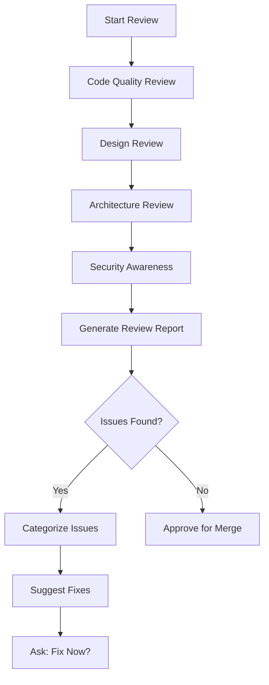

# /oa-review — Code, Design, and Architecture Review

> Comprehensive review covering code quality, UI/UX design, and software architecture.

## Purpose

Ensure code quality, design consistency, and architectural soundness before merging to main branch.

## When to Use

- After `/oa-execute` (optional auto-run)
- Before `/oa-ship` (recommended)
- Manual review: `/oa-review`
- When user asks: "review 代码", "代码审查", "设计审查", "架构审查", "review this PR"

## Workflow



## Review Categories

### 1. Code Quality Review

**Purpose**: Ensure code is clean, maintainable, and follows best practices.

**Checklist**:

#### Code Style
- [ ] Consistent naming conventions (camelCase, PascalCase, snake_case)
- [ ] Consistent indentation and formatting
- [ ] No magic numbers (use constants)
- [ ] No hardcoded values (use configuration)
- [ ] No commented-out code
- [ ] No debug console.log statements

#### Code Structure
- [ ] Functions are small and focused (single responsibility)
- [ ] Functions have descriptive names
- [ ] No deeply nested code (max 3 levels)
- [ ] No duplicate code (DRY principle)
- [ ] Proper use of early returns
- [ ] Proper error handling

#### Code Readability
- [ ] Clear variable and function names
- [ ] Comments explain "why", not "what"
- [ ] Complex logic is documented
- [ ] Self-documenting code preferred over comments

#### Code Performance
- [ ] No obvious performance bottlenecks
- [ ] Efficient algorithms chosen
- [ ] No unnecessary computations
- [ ] Proper use of caching

---

### 2. Design Review (UI/UX)

**Purpose**: Ensure UI/UX consistency, accessibility, and user-friendliness.

**Checklist**:

#### UI Consistency
- [ ] Consistent color palette used
- [ ] Consistent typography (font sizes, weights, line heights)
- [ ] Consistent spacing (margins, paddings, gaps)
- [ ] Consistent component styles (buttons, inputs, cards)
- [ ] Consistent icon usage
- [ ] Consistent visual hierarchy

#### UX Best Practices
- [ ] Clear call-to-action buttons
- [ ] Intuitive navigation
- [ ] Proper form validation with clear error messages
- [ ] Loading states for async operations
- [ ] Success/error feedback for user actions
- [ ] Responsive design (desktop, tablet, mobile)

#### Accessibility (WCAG 2.1)
- [ ] Color contrast ratio >= 4.5:1 (normal text)
- [ ] Color contrast ratio >= 3:1 (large text)
- [ ] All images have alt text
- [ ] All form inputs have labels
- [ ] Focus states are visible
- [ ] Keyboard navigation works
- [ ] Screen reader compatible

#### Responsive Design
- [ ] Desktop layout (1280px+)
- [ ] Tablet layout (768px-1279px)
- [ ] Mobile layout (320px-767px)
- [ ] Touch-friendly targets (min 44x44px)
- [ ] Readable text at all sizes

#### Visual Polish
- [ ] No layout overflow
- [ ] No horizontal scroll on mobile
- [ ] Smooth transitions and animations
- [ ] Proper image loading (lazy load, srcset)
- [ ] Consistent border radius
- [ ] Consistent shadow styles

---

### 3. Architecture Review

**Purpose**: Ensure software architecture is sound, maintainable, and scalable.

**Checklist**:

#### SOLID Principles
- [ ] **S**ingle Responsibility: Each module has one reason to change
- [ ] **O**pen/Closed: Open for extension, closed for modification
- [ ] **L**iskov Substitution: Subtypes are substitutable for base types
- [ ] **I**nterface Segregation: Clients shouldn't depend on unused interfaces
- [ ] **D**ependency Inversion: Depend on abstractions, not concretions

#### Design Patterns
- [ ] Appropriate design patterns used
- [ ] Patterns applied correctly (not over-engineering)
- [ ] Consistent pattern usage across codebase
- [ ] Factory, Singleton, Observer, Strategy, etc. used where appropriate

#### Module Coupling
- [ ] Low coupling between modules
- [ ] High cohesion within modules
- [ ] Clear module boundaries
- [ ] Minimal circular dependencies
- [ ] Dependency injection where appropriate

#### Layered Architecture
- [ ] Clear separation of concerns (presentation, business, data)
- [ ] Each layer has single responsibility
- [ ] Layers communicate through well-defined interfaces
- [ ] No layer bypassing

#### Error Handling
- [ ] Consistent error handling strategy
- [ ] Errors are logged with context
- [ ] User-friendly error messages
- [ ] Graceful degradation
- [ ] Proper exception handling

#### Dependency Management
- [ ] Dependencies are up-to-date
- [ ] No known vulnerabilities in dependencies
- [ ] Minimal dependency footprint
- [ ] Dependencies are necessary (no bloat)

#### Scalability
- [ ] Architecture can handle increased load
- [ ] Stateless where possible
- [ ] Proper caching strategy
- [ ] Database queries optimized
- [ ] API rate limiting implemented

---

### 4. Security Awareness

**Purpose**: Ensure no obvious security vulnerabilities (detailed check in `/oa-security`).

**Quick Check**:
- [ ] No hardcoded secrets/credentials
- [ ] Input validation present
- [ ] Output encoding (prevent XSS)
- [ ] Parameterized queries (prevent SQL injection)
- [ ] Proper authentication/authorization
- [ ] HTTPS enforced

---

## Integration Points

### After `/oa-execute`

```
/oa-execute → /oa-review (optional)
```

User can enable auto-run in project settings.

---

### Before `/oa-ship`

```
/oa-review → /oa-ship
```

Run review before shipping. Blocking if critical issues found.

---

### Manual Invocation

```
/oa-review
```

Run manual review on current codebase.

---

## Output Format

### Review Report

```markdown
# Code, Design, and Architecture Review

**Project**: [project name]
**Date**: [timestamp]
**Reviewer**: [AI agent]

---

## Summary

- **Code Quality**: 3 minor issues
- **Design (UI/UX)**: 2 medium issues
- **Architecture**: 1 major issue
- **Security**: 0 issues (see /oa-security for detailed check)

**Overall Status**: ⚠️ Needs Improvements

---

## Code Quality Review

### Issues Found: 3

#### Issue #1: Magic Number in Calculation

**Severity**: Minor
**Location**: `src/utils/pricing.js:23`
**Description**: Hardcoded number `0.15` used without explanation.

**Current Code**:
```javascript
const discount = price * 0.15;
```

**Recommendation**: Use named constant.
```javascript
const DISCOUNT_RATE = 0.15; // 15% discount
const discount = price * DISCOUNT_RATE;
```

---

#### Issue #2: Deeply Nested Code

**Severity**: Minor
**Location**: `src/services/order.js:45-60`
**Description**: 4 levels of nesting, hard to read.

**Recommendation**: Extract to separate function or use early returns.

---

#### Issue #3: Missing Error Handling

**Severity**: Minor
**Location**: `src/api/users.js:34`
**Description**: API call without error handling.

**Recommendation**: Add try-catch block.

---

## Design Review (UI/UX)

### Issues Found: 2

#### Issue #1: Low Color Contrast

**Severity**: Medium
**Location**: `src/styles/buttons.css:12`
**Element**: `.cta-button`
**Foreground**: #FFFFFF
**Background**: #FF6B6B
**Contrast Ratio**: 3.2:1 (WCAG AA requires >= 4.5:1)

**Recommendation**: Darken background to #E63946 (contrast ratio: 4.8:1)

---

#### Issue #2: Missing Focus State

**Severity**: Medium
**Location**: `src/components/Button.jsx:15`
**Description**: Button lacks visible focus state for keyboard navigation.

**Recommendation**: Add focus styles.
```css
.button:focus {
  outline: 2px solid #007BFF;
  outline-offset: 2px;
}
```

---

## Architecture Review

### Issues Found: 1

#### Issue #1: High Module Coupling

**Severity**: Major
**Location**: `src/services/user.js`
**Description**: UserService directly imports and depends on 8 other services, making it hard to test and maintain.

**Current Dependencies**:
```javascript
import { AuthService } from './auth';
import { EmailService } from './email';
import { PaymentService } from './payment';
import { NotificationService } from './notification';
import { AnalyticsService } from './analytics';
import { CacheService } from './cache';
import { LoggerService } from './logger';
import { ConfigService } from './config';
```

**Recommendation**: 
1. Use dependency injection
2. Extract some functionality to separate modules
3. Consider using event-driven architecture for notifications and analytics

---

## Security Review

✓ No obvious security vulnerabilities detected.

For comprehensive security audit, run `/oa-security`.

---

## Summary Table

| Category | Minor | Medium | Major | Critical |
|----------|-------|--------|-------|----------|
| Code Quality | 3 | 0 | 0 | 0 |
| Design (UI/UX) | 0 | 2 | 0 | 0 |
| Architecture | 0 | 0 | 1 | 0 |
| Security | 0 | 0 | 0 | 0 |
| **Total** | **3** | **2** | **1** | **0** |

---

## Recommendations

1. **High Priority**: Reduce module coupling in UserService (Architecture)
2. **Medium Priority**: Fix color contrast issues (Design)
3. **Low Priority**: Clean up magic numbers and deep nesting (Code Quality)

---

## Next Steps

1. Fix architecture issue (high coupling)
2. Fix design issues (contrast, focus states)
3. Refactor code quality issues (magic numbers, nesting)
4. Re-run `/oa-review` to verify fixes
5. Proceed to `/oa-ship` if all issues resolved
```

---

## Severity Classification

| Severity | Definition | Action |
|----------|------------|--------|
| Critical | Blocks merge, security risk, data loss | Fix immediately |
| Major | Significant code/architecture issue | Fix before merge |
| Medium | Design issue, minor performance | Recommend fix |
| Minor | Code style, readability | Inform, optional fix |

---

## Configuration

### Enable Auto-Run After Execute

In `project.md`:
```markdown
## Review Settings

- Auto-run review after execute: true
- Block ship on critical: true
- Block ship on major: false
- Design review enabled: true
- Architecture review enabled: true
```

---

### Custom Review Rules

See `lib/review/design-checklist.md` for UI/UX design review checklist.
See `lib/review/architecture-checklist.md` for architecture review checklist.

Custom rules can be added in `lib/review/custom-rules.md` (create if needed):
```markdown
## Custom Review Rules

### Code Style
- Max function length: 50 lines
- Max nesting level: 3
- No var keyword (use const/let)

### Design
- Primary color: #007BFF
- Border radius: 8px
- Font family: Inter

### Architecture
- No circular dependencies
- Max module dependencies: 5
- Stateless preferred
```

---

## Examples

### Example 1: Full Review

```
User: /oa-review

AI: Running code, design, and architecture review...

Code Quality Review:
✓ Naming conventions: Pass
✓ Code structure: Pass
✗ Readability: 3 issues found
  → Magic number at pricing.js:23
  → Deep nesting at order.js:45
  → Missing error handling at users.js:34

Design Review (UI/UX):
✓ UI consistency: Pass
✗ Accessibility: 2 issues found
  → Low contrast ratio (3.2:1, need 4.5:1)
  → Missing focus state on button
✓ Responsive design: Pass

Architecture Review:
✗ Module coupling: 1 major issue
  → UserService has 8 dependencies (recommend max 5)
✓ SOLID principles: Pass
✓ Error handling: Pass

Security Quick Check:
✓ No hardcoded secrets
✓ Input validation present

Review complete. Found 6 issues (3 minor, 2 medium, 1 major).

Recommendation: Fix architecture issue before merge.
```

---

### Example 2: Design-Only Review

```
User: 审查一下设计

AI: Running design review...

UI Consistency:
✓ Color palette: Pass
✓ Typography: Pass
✓ Spacing: Pass

Accessibility (WCAG 2.1):
✗ Color contrast: 2 violations
  → .cta-button: 3.2:1 (need >= 4.5:1)
  → .text-muted: 3.5:1 (need >= 4.5:1)
✗ Focus states: Missing on 5 elements

Responsive Design:
✓ Desktop: Pass
✓ Tablet: Pass
✓ Mobile: Pass

Design review complete. Found 2 medium issues.

Recommendation: Improve color contrast and add focus states.
```

---

### Example 3: Architecture-Only Review

```
User: 审查一下架构

AI: Running architecture review...

SOLID Principles:
✓ Single Responsibility: Pass
✓ Open/Closed: Pass
✗ Liskov Substitution: 1 violation
  → AdminUser overrides User.logout() without calling super

Module Coupling:
✗ High coupling detected in 2 modules
  → UserService: 8 dependencies
  → OrderService: 7 dependencies

Layered Architecture:
✓ Presentation layer: Pass
✓ Business layer: Pass
✓ Data layer: Pass

Architecture review complete. Found 2 major issues.

Recommendation: Reduce coupling and fix LSP violation.
```

---

## 相关 Skills

- `/oa-security` — Detailed security audit (OWASP + STRIDE)
- `/oa-verify` — Testing and verification (code coverage)
- `/oa-ship` — Ship (blocked by review issues)
- `/oa-qa-browser` — Browser testing (includes accessibility tests)

---

## Further Reading

- Clean Code: https://github.com/ryanmcdermott/clean-code-javascript
- SOLID Principles: https://www.digitalocean.com/community/conceptual_articles/s-o-l-i-d-the-first-five-principles-of-object-oriented-design
- WCAG 2.1: https://www.w3.org/WAI/WCAG21/quickref/
- Design Patterns: https://refactoring.guru/design-patterns

---

## Notes

- Review is **not a replacement** for human code review
- Use as pre-merge check, not final gate
- Combine with `/oa-security` for comprehensive coverage
- User is responsible for final decisions on fixes
- Run `/oa-review` before every `/oa-ship` for best results