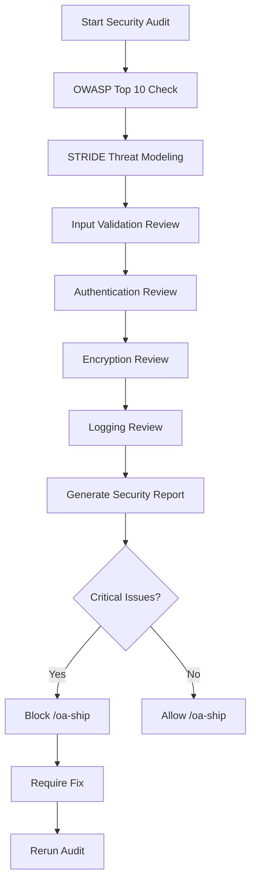

# /oa-security — Security Audit

> Automated security review using OWASP Top 10 and STRIDE threat modeling.

## Purpose

Detect security vulnerabilities early in the development cycle. Prevent common security issues before production deployment.

## When to Use

- After completing `/oa-execute` phase
- Before `/oa-ship` (optional auto-run)
- Manual security audit: `/oa-security`
- When user asks: "检查安全性", "security review", "安全审计"

## Workflow



## Checklist

### OWASP Top 10 (2021)

#### A01: Broken Access Control

- [ ] Verify authorization checks on all sensitive operations
- [ ] Check for path traversal vulnerabilities
- [ ] Validate user permissions before data access
- [ ] Test for privilege escalation scenarios
- [ ] Review API endpoint access controls

**Common patterns**:
```javascript
// Bad: No authorization check
app.get('/admin/users', (req, res) => {
  res.json(users);
});

// Good: Authorization check
app.get('/admin/users', authenticate, authorize('admin'), (req, res) => {
  res.json(users);
});
```

---

#### A02: Cryptographic Failures

- [ ] Verify sensitive data is encrypted at rest
- [ ] Check TLS/SSL configuration (HTTPS only)
- [ ] Validate cryptographic algorithm strength (AES-256, RSA-2048)
- [ ] Review key management practices
- [ ] Check for hardcoded secrets/keys

**Common patterns**:
```javascript
// Bad: Hardcoded secret
const apiKey = 'sk-1234567890';

// Good: Environment variable
const apiKey = process.env.API_KEY;
```

---

#### A03: Injection

- [ ] Validate all user inputs (type, length, format)
- [ ] Use parameterized queries for SQL
- [ ] Escape special characters in user input
- [ ] Review ORM/query builder usage
- [ ] Test for XSS vulnerabilities (HTML/JS injection)

**Common patterns**:
```javascript
// Bad: SQL injection
const query = `SELECT * FROM users WHERE id = ${userId}`;

// Good: Parameterized query
const query = 'SELECT * FROM users WHERE id = ?';
db.query(query, [userId]);
```

---

#### A04: Insecure Design

- [ ] Review threat modeling documentation
- [ ] Check for business logic flaws
- [ ] Validate rate limiting on sensitive endpoints
- [ ] Review password reset flow security
- [ ] Check for insecure direct object references

---

#### A05: Security Misconfiguration

- [ ] Review default credentials (remove/change)
- [ ] Check for unnecessary features enabled
- [ ] Verify error handling (no sensitive info in errors)
- [ ] Review CORS configuration
- [ ] Check for missing security headers

**Common patterns**:
```javascript
// Bad: Exposing stack traces
app.use((err, req, res, next) => {
  res.status(500).json({ error: err.stack });
});

// Good: Generic error message
app.use((err, req, res, next) => {
  res.status(500).json({ error: 'Internal server error' });
});
```

---

#### A06: Vulnerable and Outdated Components

- [ ] Check dependency versions (npm audit, pip audit)
- [ ] Review for known CVEs in dependencies
- [ ] Verify automatic dependency updates
- [ ] Check for deprecated packages
- [ ] Review dependency license compatibility

---

#### A07: Identification and Authentication Failures

- [ ] Verify password strength requirements
- [ ] Check for brute force protection (rate limiting)
- [ ] Review session management (timeout, secure cookies)
- [ ] Validate multi-factor authentication (if applicable)
- [ ] Check for credential stuffing vulnerabilities

**Common patterns**:
```javascript
// Bad: Weak password policy
if (password.length >= 4) { ... }

// Good: Strong password policy
if (password.length >= 12 && 
    /[A-Z]/.test(password) &&
    /[a-z]/.test(password) &&
    /[0-9]/.test(password) &&
    /[^A-Za-z0-9]/.test(password)) { ... }
```

---

#### A08: Software and Data Integrity Failures

- [ ] Verify CI/CD pipeline security
- [ ] Review auto-update mechanisms
- [ ] Check for unsigned code/packages
- [ ] Validate CI pipeline access controls
- [ ] Review code review requirements

---

#### A09: Security Logging and Monitoring Failures

- [ ] Verify logging of security events (login, access denied)
- [ ] Check for log injection vulnerabilities
- [ ] Review log retention policy
- [ ] Validate monitoring and alerting
- [ ] Check for audit trail (who, what, when)

**Common patterns**:
```javascript
// Bad: No logging
app.post('/login', (req, res) => { ... });

// Good: Security event logging
app.post('/login', (req, res) => {
  logger.info('Login attempt', { 
    user: req.body.username,
    ip: req.ip,
    timestamp: new Date()
  });
});
```

---

#### A10: Server-Side Request Forgery (SSRF)

- [ ] Validate URLs from user input
- [ ] Check for internal network access from external requests
- [ ] Review webhook/callback URL validation
- [ ] Test for cloud metadata endpoint access
- [ ] Validate file upload URL restrictions

---

### STRIDE Threat Modeling

#### Spoofing

- [ ] Verify user identity authentication
- [ ] Check for session token validation
- [ ] Review API key authentication
- [ ] Test for impersonation scenarios

---

#### Tampering

- [ ] Validate data integrity checks (checksums)
- [ ] Review input validation
- [ ] Check for unauthorized data modification
- [ ] Verify database transaction integrity

---

#### Repudiation

- [ ] Verify audit logging (non-repudiation)
- [ ] Check for immutable logs
- [ ] Review digital signatures (if applicable)
- [ ] Validate timestamp accuracy

---

#### Information Disclosure

- [ ] Verify data encryption (sensitive fields)
- [ ] Check for proper error handling (no leaks)
- [ ] Review API response filtering (no sensitive data)
- [ ] Validate access control on sensitive endpoints

---

#### Denial of Service

- [ ] Verify rate limiting
- [ ] Check for resource exhaustion scenarios
- [ ] Review timeout configurations
- [ ] Validate input size limits

---

#### Elevation of Privilege

- [ ] Verify authorization checks
- [ ] Review role-based access control (RBAC)
- [ ] Check for privilege escalation paths
- [ ] Validate admin-only operations

---

## Integration Points

### After `/oa-execute`

```
/oa-execute → /oa-security (optional)
```

User can enable auto-run in project settings.

---

### Before `/oa-ship`

```
/oa-security → /oa-ship
```

If critical issues found, block `/oa-ship` until fixed.

---

### Manual Invocation

```
/oa-security
```

Run full security audit on current project.

---

## Output Format

### Security Report

```markdown
# Security Audit Report

**Project**: [project name]
**Date**: [timestamp]
**Auditor**: [AI agent]

---

## Summary

- **Critical**: 0 issues
- **High**: 1 issue
- **Medium**: 3 issues
- **Low**: 2 issues

---

## Findings

### High Severity

#### Finding #1: SQL Injection in User Search

**Category**: A03: Injection
**Location**: `src/api/users.js:45`
**Description**: User search endpoint uses string interpolation for SQL query.
**Impact**: Attacker can execute arbitrary SQL queries, potentially accessing all user data.
**Recommendation**: Use parameterized queries.

**Code**:
```javascript
// Current (vulnerable)
const query = `SELECT * FROM users WHERE name LIKE '%${searchTerm}%'`;

// Recommended (secure)
const query = 'SELECT * FROM users WHERE name LIKE ?';
db.query(query, [`%${searchTerm}%`]);
```

---

### Medium Severity

#### Finding #2: Missing Rate Limiting on Login

**Category**: A07: Authentication Failures
**Location**: `src/api/auth.js:23`
**Description**: No rate limiting on login endpoint.
**Impact**: Susceptible to brute force attacks.
**Recommendation**: Add rate limiting middleware.

---

## Recommendations

1. Fix SQL injection immediately (Critical)
2. Add rate limiting to auth endpoints (High)
3. Review CORS configuration (Medium)
4. Add security headers (Low)
5. Enable audit logging (Low)

---

## Next Steps

1. Fix critical/high issues
2. Rerun `/oa-security`
3. Proceed to `/oa-ship` if all critical/high issues resolved
```

---

## Severity Classification

| Severity | Definition | Action |
|----------|------------|--------|
| Critical | Immediate exploitation possible, high impact | Block ship, fix immediately |
| High | Exploitable with moderate effort | Block ship, fix before merge |
| Medium | Exploitable with significant effort | Warn, recommend fix |
| Low | Limited impact or difficult exploitation | Inform, optional fix |

---

## Automated Tools

### Dependency Audit

```bash
# Node.js
npm audit

# Python
pip-audit

# Go
go list -m all | nancy
```

---

### Security Headers Check

```bash
# Using securityheaders.com
curl -I https://your-app.com | grep -i "x-frame-options\|x-content-type\|strict-transport"
```

---

### OWASP ZAP (Optional)

For comprehensive automated testing:
```bash
zap-baseline.py -t https://your-app.com
```

---

## Configuration

### Enable Auto-Run After Execute

In `project.md`:
```markdown
## Security Settings

- Auto-run security audit: true
- Block ship on critical: true
- Block ship on high: false
```

---

### Custom Security Rules

See `lib/security/checklist.md` for OWASP/STRIDE checklist.
See `lib/security/patterns.md` for security patterns and examples.

Custom rules can be added in `lib/security/custom-rules.md` (create if needed):
```markdown
## Custom Security Rules

- No hardcoded API keys (enforced)
- Require HTTPS for all external requests
- Minimum password length: 12 characters
```

---

## Examples

### Example 1: Full Security Audit

```
User: /oa-security

AI: Running security audit...

✓ OWASP A01: Broken Access Control - 0 issues
✗ OWASP A03: Injection - 1 high severity issue
  → Location: src/api/users.js:45
  → SQL injection in user search

✓ OWASP A02: Cryptographic - 0 issues
...

Security audit complete. Found 1 high severity issue.

Recommendation: Fix SQL injection before proceeding to /oa-ship.
```

---

### Example 2: Quick Security Check

```
User: 快速检查安全性

AI: Running quick security check...

✓ No hardcoded secrets found
✗ Dependency vulnerability: lodash@4.17.15 has CVE-2020-8204
  → Update to lodash@4.17.21

Recommendation: Run npm update lodash.
```

---

### Example 3: Security Before Ship

```
User: /oa-ship

AI: Running pre-ship security check...

✗ Critical issue found: SQL injection in users.js:45
→ Blocking ship operation

Fix the issue and rerun /oa-security before proceeding.
```

---

## Related Skills

- `/oa-review` — Code review (includes security awareness)
- `/oa-verify` — Testing and verification (includes security tests)
- `/oa-ship` — Ship (blocked by security issues)

---

## Further Reading

- OWASP Top 10 2021: https://owasp.org/Top10/
- STRIDE Threat Modeling: https://docs.microsoft.com/en-us/azure/security/develop/threat-modeling-tool-threats
- CWE/SANS Top 25: https://cwe.mitre.org/top25/

---

## Notes

- Security audit is **not a replacement** for professional security review
- Use as early detection mechanism, not final gate
- Combine with automated tools (npm audit, OWASP ZAP) for comprehensive coverage
- User is responsible for final security decisions