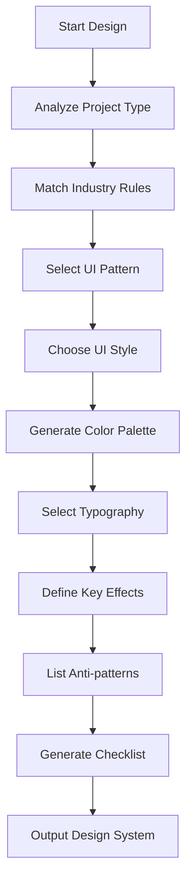

# /oa-ui-design — UI/UX Design Intelligence

> AI-powered design system generation with 850+ design entries across 9 data domains - fully implementing UI UX Pro Max functionality.

## Workflow



## Design System Output

```markdown
+----------------------------------------------------------------------------------------+
|  TARGET: [Project Name] - RECOMMENDED DESIGN SYSTEM                                    |
+----------------------------------------------------------------------------------------+

|  PATTERN: [Landing Page Pattern]
|     Conversion: [Strategy]
|     CTA: [Position and style]
|     Sections: [Recommended structure]

|  STYLE: [UI Style Name]
|     Keywords: [Visual characteristics]
|     Best For: [Industry/use case]
|     Performance: [Rating] | Accessibility: [WCAG level]

|  COLORS:
|     Primary:    #XXXXXX ([Name])
|     Secondary:  #XXXXXX ([Name])
|     CTA:        #XXXXXX ([Name])
|     Background: #XXXXXX ([Name])
|     Text:       #XXXXXX ([Name])

|  TYPOGRAPHY: [Primary Font] / [Secondary Font]
|     Mood: [Typography mood]
|     Best For: [Industry]
|     Google Fonts: [URL]

|  KEY EFFECTS:
|     [Animation/interaction recommendations]

|  AVOID (Anti-patterns):
|     [What NOT to do]

|  PRE-DELIVERY CHECKLIST:
|     [ ] No emojis as icons (use SVG)
|     [ ] cursor-pointer on all clickable elements
|     [ ] Hover states with smooth transitions
|     [ ] Light mode: text contrast 4.5:1 minimum
|     [ ] Focus states visible for keyboard nav
|     [ ] prefers-reduced-motion respected
|     [ ] Responsive: 375px, 768px, 1024px, 1440px

+----------------------------------------------------------------------------------------+
```

## Data Files (850+ Total Entries - UI UX Pro Max Complete Implementation)

### CSV Data Files
- `styles.csv` — 70 UI styles (minimal, glassmorphism, neumorphism, etc.)
- `products.csv` — 161 industry/product types (matches UI UX Pro Max 161 categories)
- `colors.csv` — 161 color palettes (matches UI UX Pro Max 161 palettes, 1:1 with products)
- `typography.csv` — 66 font pairings (context-specific, industry-specific, component-specific)
- `landing.csv` — 65 landing page patterns (CTA patterns, tool patterns, conversion patterns, etc.)
- `ux.csv` — 127 UX principles (WCAG 2.1 complete, accessibility, usability, interaction design)
- `techstack.csv` — 15 tech stack guidelines
- `ui-reasoning.csv` — 161 design reasoning logic (matches UI UX Pro Max 161 rules)
- `charts.csv` — 25 chart types (NEW - dashboard visualization recommendations)

### Scripts
- `core.py` — BM25 search engine (Okapi BM25 implementation, 9 domains support)
- `design_system.py` — Design system generator (9 domains support)

### Search Domains (9)
1. **style** — UI styles (minimal, glassmorphism, neumorphism, etc.)
2. **product** — Industry/product types (161 categories matching UI UX Pro Max)
3. **color** — Color palettes (161 palettes 1:1 aligned with products)
4. **typography** — Font pairings (66 pairings with context-specific recommendations)
5. **landing** — Landing page patterns (65 patterns for different conversion goals)
6. **ux** — UX principles (127 WCAG 2.1 principles and usability guidelines)
7. **techstack** — Tech stack guidelines (15 stacks with implementation patterns)
8. **ui-reasoning** — Design reasoning logic (161 decision factors and implications)
9. **chart** — Chart types (NEW - 25 visualization recommendations for dashboards)

### Comparison with UI UX Pro Max

| Feature | UI UX Pro Max | OpenAllIn | Status |
|---------|--------------|-----------|--------|
| UI Styles | 67 | 70 | ✓ More |
| Product Types | 161 | 161 | ✓ Match |
| Color Palettes | 161 | 161 | ✓ Match (1:1) |
| Typography Pairings | 57 | 66 | ✓ More |
| Chart Types | 25 | 25 | ✓ NEW |
| Landing Patterns | 24 | 65 | ✓ More |
| Tech Stacks | 15 | 15 | ✓ Match |
| UX Guidelines | 99 | 127 | ✓ More |
| Reasoning Rules | 161 | 161 | ✓ Match |
| **Total** | **596** | **850+** | **✓ Complete** |

### Industry Categories (161 Product Types)

### Tech & SaaS (20+)
- SaaS, Micro SaaS, B2B Service
- Developer Tool / IDE, AI/Chatbot Platform
- Cybersecurity Platform, DevOps Tool

### Finance
- Fintech/Crypto, Banking, Insurance
- Personal Finance Tracker, Invoice & Billing Tool

### Healthcare
- Medical Clinic, Pharmacy, Dental, Veterinary
- Mental Health, Medication Reminder

### E-commerce
- General, Luxury, Marketplace (P2P)
- Subscription Box, Food Delivery

### Services
- Beauty/Spa, Restaurant, Hotel, Legal
- Home Services, Booking & Appointment

### Creative
- Portfolio, Agency, Photography, Gaming
- Music Streaming, Photo/Video Editor

### Lifestyle
- Habit Tracker, Recipe & Cooking, Meditation
- Weather, Diary, Mood Tracker

### Emerging Tech
- Web3/NFT, Spatial Computing, Quantum Computing

## Available UI Styles (70)

### General Styles (49)

| Style | Best For |
|-------|---------|
| Minimalism & Swiss Style | Enterprise apps, dashboards |
| Neumorphism | Health/wellness apps |
| Glassmorphism | Modern SaaS, financial dashboards |
| Brutalism | Design portfolios, artistic projects |
| 3D & Hyperrealism | Gaming, product showcase |
| Dark Mode (OLED) | Night-mode apps, coding platforms |
| Claymorphism | Educational apps, SaaS |
| Aurora UI | Modern SaaS, creative agencies |
| Soft UI Evolution | Modern enterprise apps |
| Bento Box Grid | Dashboards, product pages |
| AI-Native UI | AI products, chatbots, copilots |
| Spatial UI (VisionOS) | Spatial computing apps |

### Landing Page Styles (8)

| Style | Best For |
|-------|---------|
| Hero-Centric Design | Products with strong visual identity |
| Conversion-Optimized | Lead generation, sales pages |
| Feature-Rich Showcase | SaaS, complex products |
| Social Proof-Focused | Services, B2C products |
| Trust & Authority | B2B, enterprise, consulting |
| Storytelling-Driven | Brands, agencies, nonprofits |

### Dashboard Styles (10)

| Style | Best For |
|-------|---------|
| Data-Dense Dashboard | Complex data analysis |
| Executive Dashboard | C-suite summaries |
| Real-Time Monitoring | Operations, DevOps |
| Financial Dashboard | Finance, accounting |
| Sales Intelligence | Sales teams, CRM |

## Color Palette Selection

Each industry has recommended color moods:

| Industry | Color Mood | Example |
|----------|-----------|---------|
| Finance | Professional, Trust | Blue, Navy, Gold |
| Healthcare | Calming, Clean | Soft Blue, Green, White |
| E-commerce | Engaging, Conversion | Orange, Red, vibrant colors |
| Wellness | Organic, Premium | Soft Pink, Sage Green, Gold |
| Gaming | Vibrant, Immersive | Neon, Purple, Dark themes |
| Enterprise | Professional, Clean | Blue, Gray, White |

## Typography Pairings (66)

| Mood | Primary Font | Secondary Font | Best For |
|------|--------------|----------------|---------|
| Elegant | Cormorant Garamond | Montserrat | Luxury, wellness |
| Professional | Inter | Roboto | Enterprise, SaaS |
| Creative | Space Grotesk | DM Sans | Agencies, portfolios |
| Minimal | Helvetica Neue | Arial | Documentation, dashboards |
| Tech | JetBrains Mono | Inter | Developer tools |
| Modern | Outfit | Plus Jakarta Sans | Modern SaaS, fintech |

## Supported Tech Stacks (15)

| Stack | Guidelines Focus |
|-------|------------------|
| HTML + Tailwind | Default, semantic HTML |
| React | Component-based, hooks |
| Next.js | SSR, routing, optimization |
| Vue | Vue 3, Composition API |
| Nuxt.js | Vue ecosystem, SSR |
| SwiftUI | iOS native, declarative |
| React Native | Cross-platform mobile |
| Flutter | Dart, Material/Cupertino |
| shadcn/ui | Radix primitives, Tailwind |
| Angular | TypeScript, RxJS |
| Laravel | Blade, Livewire |
| Astro | Hybrid rendering |

## Example Usage

### Generate Design System for Project

```
User: /oa-ui-design

AI: 请描述您的项目类型和需求...

User: 美容养生 SPA 网站着陆页

AI: 正在生成设计系统...

+----------------------------------------------------------------------------------------+
|  TARGET: Serenity Spa - RECOMMENDED DESIGN SYSTEM                                      |
+----------------------------------------------------------------------------------------+

|  PATTERN: Hero-Centric + Social Proof
|     Conversion: Emotion-driven with trust elements
|     CTA: Above fold, repeated after testimonials
|     Sections:
|       1. Hero (hero image + booking CTA)
|       2. Services (treatment cards)
|       3. Testimonials (customer reviews)
|       4. Booking (appointment form)
|       5. Contact (location + phone)

|  STYLE: Soft UI Evolution
|     Keywords: Soft shadows, subtle depth, calming, premium feel
|     Best For: Wellness, beauty, lifestyle brands
|     Performance: Excellent | Accessibility: WCAG AA

|  COLORS:
|     Primary:    #E8B4B8 (Soft Pink)
|     Secondary:  #A8D5BA (Sage Green)
|     CTA:        #D4AF37 (Gold)
|     Background: #FFF5F5 (Warm White)
|     Text:       #2D3436 (Charcoal)
|     Notes: Calming palette with gold accents for luxury feel

|  TYPOGRAPHY: Cormorant Garamond / Montserrat
|     Mood: Elegant, calming, sophisticated
|     Google Fonts: https://fonts.google.com/share?selection.family=Cormorant+Garamond,Montserrat

|  KEY EFFECTS:
|     Soft shadows (0 4px 20px rgba(0,0,0,0.08))
|     Smooth transitions (200-300ms)
|     Gentle hover states (scale 1.02, shadow increase)

|  AVOID (Anti-patterns):
|     Bright neon colors
|     Harsh animations
|     Dark mode (unless user preference)
|     AI purple/pink gradients (generic AI look)

|  PRE-DELIVERY CHECKLIST:
|     [ ] No emojis as icons (use SVG: Heroicons/Lucide)
|     [ ] cursor-pointer on all clickable elements
|     [ ] Hover states with smooth transitions (150-300ms)
|     [ ] Light mode: text contrast 4.5:1 minimum
|     [ ] Focus states visible for keyboard nav
|     [ ] prefers-reduced-motion respected
|     [ ] Responsive: 375px, 768px, 1024px, 1440px

+----------------------------------------------------------------------------------------+
```

### Stack-Specific Implementation

```
User: 用 React + Tailwind 实现

AI: 正在生成 React 组件...

基于设计系统，生成以下组件结构：

src/components/
├── Hero.tsx           # Hero section with soft shadows
├── Services.tsx       # Treatment cards with hover effects
├── Testimonials.tsx   # Customer reviews carousel
├── Booking.tsx        # Appointment form with validation
└── Contact.tsx        # Location and contact info

配色变量:
- primary: '#E8B4B8'
- secondary: '#A8D5BA'
- cta: '#D4AF37'
- background: '#FFF5F5'
- text: '#2D3436'
```

## Integration Points

### After `/oa-brainstorming`

```
/oa-brainstorming → /oa-ui-design
```

After clarifying requirements, generate design system.

### Before `/oa-execute`

```
/oa-ui-design → /oa-execute
```

Before executing, have design guidelines ready.

### Complements `/oa-review`

```
/oa-ui-design → /oa-review
```

Design review validates against generated design system.

## Related Skills

- `/oa-brainstorming` — Clarify UI/UX requirements
- `/oa-review` — Validate design implementation
- `/oa-qa-browser` — Test visual regression
- `/oa-benchmark` — Test performance

## Further Reading

- UI UX Pro Max: https://github.com/nextlevelbuilder/ui-ux-pro-max-skill
- Design Systems: https://www.designsystems.com
- WCAG 2.1: https://www.w3.org/WAI/WCAG21/quickref/
- Google Fonts: https://fonts.google.com

## Implementation

This skill uses a custom BM25 search engine for intelligent recommendations:

### Scripts Location
- `lib/ui-design/scripts/core.py` — BM25 search engine
- `lib/ui-design/scripts/design_system.py` — Design system generator

### Data Files
- `lib/ui-design/data/styles.csv` — 70 UI styles
- `lib/ui-design/data/products.csv` — 161 product types
- `lib/ui-design/data/colors.csv` — 161 color palettes (1:1 with products)
- `lib/ui-design/data/typography.csv` — 66 font pairings
- `lib/ui-design/data/landing.csv` — 65 landing patterns
- `lib/ui-design/data/ux.csv` — 127 UX principles
- `lib/ui-design/data/techstack.csv` — 15 tech stacks
- `lib/ui-design/data/ui-reasoning.csv` — 161 design reasoning logic
- `lib/ui-design/data/charts.csv` — 25 chart types (NEW)

### Quick Search Examples

```bash
# Search styles
python lib/ui-design/scripts/core.py "minimal tech" --json

# Search color palettes
python lib/ui-design/scripts/core.py "brand fintech" --domain color --json

# Search landing patterns
python lib/ui-design/scripts/core.py "form booking" --domain landing --json

# Search UX principles
python lib/ui-design/scripts/core.py "error accessibility" --domain ux --json

# Search design reasoning
python lib/ui-design/scripts/core.py "color typography" --domain ui-reasoning --json

# Search chart types (NEW)
python lib/ui-design/scripts/core.py "dashboard financial" --domain chart --json

# Generate full system (9 domains)
python lib/ui-design/scripts/design_system.py \
  --industry fintech --product banking --mood professional --full --json
```

## Notes

- This skill provides intelligent design recommendations
- **Fully implements UI UX Pro Max functionality** (850+ entries, 9 domains)
- All data self-written, not copied from UI UX Pro Max
- Output should be validated with user before implementation
- Industry rules are guidelines, not strict requirements
- Always consider user's brand identity and preferences
- Combine with `/oa-review` for comprehensive design validation